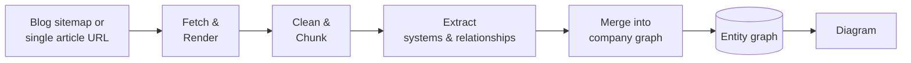

# pyro Architecture

This is the big-picture design doc for pyro — what it does, how the pieces fit together
conceptually, and the reasoning behind the non-obvious decisions. For setup and day-to-day
usage, see the root [README](../README.md). This doc stays at the concept level on purpose —
it's meant to orient a reader before they open any code, not to mirror it.

## What this is

pyro turns a company's engineering blog into a system map: a single diagram showing the
services, datastores, queues, and external systems that blog has ever described, and how they
relate to each other. Point it at a blog and it crawls the posts, reads each one for the
concrete systems it mentions, and — as more posts come in — merges what it finds into one
growing, company-wide graph.

This is deliberately not a set of per-post or per-topic summaries. A single blog post rewritten
by an AI still reads like that one post; a graph assembled from years of posts shows something
no individual post could — that the queue introduced in a 2019 migration post is the same one a
2023 incident post says got replaced, that a service three different posts each mention in
passing is actually a hub half the architecture depends on. The value is in the assembly, not in
any one post's content.

## High-level flow

Every post moves through the same stages — fetch, clean, extract, merge — every time. The
pipeline is stateful and idempotent: each post's progress through these stages is tracked, so
re-running any stage only processes what hasn't reached it yet, rather than starting over.
That's what makes it safe to point the pipeline at a growing blog repeatedly instead of needing
one big all-or-nothing run.

## The layers

**Ingestion.** Given a sitemap, discovers every post URL on the blog; given a single article URL,
treats that as the whole job. Pages are rendered in a real browser rather than fetched as plain
HTML, since a lot of engineering blogs render their content client-side. Each post is
deduplicated by a normalized form of its URL, so re-pointing the pipeline at the same blog never
re-ingests a post it already has.

**Cleaning.** Strips navigation, ads, comment sections, and other boilerplate that would
otherwise dilute the signal an LLM has to work with, and collapses unusually long code blocks
(useful to a human reader, mostly noise for extraction). Unusually long posts are split into
overlapping segments so no single post exceeds what a model can reasonably process in one call.

**Extraction.** Reads each cleaned post and pulls out its system map in isolation — every
service, datastore, message queue, external system, or team the post describes as part of its
own architecture, plus every concrete relationship between them the post actually states (never
an inferred or assumed one). Each system is also tagged with a technical domain (authentication,
data platform, observability, etc.) from a fixed list — not to group or classify posts anymore,
but as a shared label systems can later be compared along, including across different companies'
graphs. A failed or malformed extraction attempt is retried against a different model rather than
accepted as-is or silently dropped.

At this stage every post is read independently — a post has no way to know that a system it
mentions is the same one another post already described under a slightly different name. That
reconciliation is the next layer's entire job.

**Model routing.** Every extraction (and later, merge) call goes through a layer that decides
*which* language model actually handles it. Rather than depending on one paid provider, calls are
tried against a prioritized list of providers — several free tiers first, in order from most to
least generous, falling through to a paid tier only if every free option is exhausted or
unavailable. If a provider is rate-limited, the same tier is retried with a wait rather than
immediately giving up on it; if a provider fails outright (outage, timeout, bad response), the
next tier in line is tried instead. This is what lets the whole pipeline run at low-to-no cost
for a blog of any size, degrading gracefully rather than stopping outright if a given provider
becomes unavailable.

**Merge.** Folds each post's independently extracted systems into the company's one running
graph, one post at a time, in order.

Resolution happens in two tiers, cheapest first. A deterministic pass matches this post's system
names against the company's already-known ones by exact and near-exact string match, absorbing
casing and punctuation drift without spending anything. Only the names it genuinely cannot settle
go to the model, which is shown those names alongside the known names most similar to them, and
decides for each whether it's the same as one already known (reuse that exact name) or genuinely
new (keep the post's own name). A post that mentions only systems the graph already knows costs no
model call at all. The similarity-based selection of which known names to show also keeps the
prompt a fixed size as the company's graph grows into the hundreds of systems, rather than growing
with it.

Name resolution is the only judgment call this layer makes; everything else the post extracted
(relationships, domain tags) carries through unchanged. Because each post's resolution needs to see
what every prior post in the same run has already settled, this happens strictly one post at a time
rather than in parallel. Once a post has been merged, it's remembered as handled so future runs only
process genuinely new posts — so a run's cost tracks how many new posts arrived, not how large the
company's graph has already grown.

**Storage.** Three things are tracked, all scoped to the company they belong to so one running
instance can serve any number of companies without their data mixing: each post's own journey
through the pipeline (what stage it's reached, what it extracted), the resolved systems, and the
resolved relationships between them.

Relationships are stored as graph edges pointing at the system records on either end, not as
standalone rows that merely name them — so questions that follow connections ("what does this
depend on", "what breaks if this goes down", "how are these two related") are answered by the
database walking the graph, rather than by loading every relationship into memory and rebuilding
the graph there each time.

The kind of connection an edge represents is drawn from a fixed vocabulary — `calls`, `writes_to`,
`routes_to`, `replaced_by` and so on — rather than being whatever phrasing a post happened to use.
This is what makes an edge between two systems mean one thing: without it, "sends requests to",
"routes requests to" and "calls" describe one connection but store as three separate edges, and
every diagram shows three arrows where there is one relationship. The model's original wording is
kept alongside the canonical form, so nothing the post actually said is lost.

**Dashboard.** A web interface for triggering runs (hand it a blog URL or a single article URL)
and watching them progress through each stage in real time, including — during the merge stage
specifically — watching each post's name-resolution call stream in, not just a "still working"
indicator. It also offers a browsing view over everything already extracted for a company, and a
live diagram of the company's current graph, independent of any particular run.

That streaming is a push, not a poll: the browser holds one open connection per running job and
receives each piece of model output once, as it is produced. The alternative it replaced — asking
the server for the merge transcript once a second — re-sent the entire transcript on every ask, so
the cost of watching a run grew with the run's own length.

**Scheduling.** Since merging only processes posts that haven't been folded into the graph yet,
it's cheap to re-run on a recurring schedule (e.g. every 15 minutes) rather than only ever being
triggered manually — a company with nothing new pending is a fast no-op, so this is the primary
way a company's graph stays caught up over time, independent of whether anyone is actively using
the dashboard.

## Configuration philosophy

Three concerns are kept deliberately separate rather than mixed into one settings file:

- **Secrets** (API keys, database credentials) — never checked in, sourced from the local
  environment only.
- **Tuning** (concurrency limits, retry policy, which domains exist, which model tiers are
  active, chunk sizes) — checked in as plain configuration, reviewable and versioned like any
  other project decision, separate from code.
- **Prompt content** — the actual instructions given to the model at each stage live as their own
  editable text, separate from both of the above, so refining how the model is asked to extract
  or merge doesn't require touching configuration or code.

## Known limitations & deliberate tradeoffs

Worth stating plainly rather than leaving implicit:

- **Run state lives in memory, in a single process.** The dashboard doesn't persist in-flight run
  status anywhere durable — restarting it loses track of anything in progress, and it can't be
  scaled to more than one instance. Acceptable for a single-instance internal tool today; the
  first thing to revisit if that changes.
- **Name resolution is a judgment call, not a guarantee.** Two posts describing the same system
  in genuinely different words (no shared proper noun, no obvious paraphrase) may end up as two
  separate nodes rather than one — the merge layer is deliberately conservative about this (a
  wrong merge silently tangles two unrelated systems together, which is worse than a missed one
  that just leaves two nodes a later pass can still reconcile).
- **The rendered diagram is a whole-company snapshot, not an interactive graph.** There's no
  filtering, zooming, or per-node drill-down yet — deleting and re-merging a company's graph is
  currently the only way to rebuild it after, say, a change to the merge prompt.
- **Automated checks aren't enforced on every change** — tests exist and pass, but nothing
  currently blocks a change from landing without running them.

## Extending the system

- **A new model provider** can be added to the routing layer's priority list, gated on its own
  credentials being configured — it's additive, so an instance runs fine on a subset of
  providers.
- **A new extraction prompt style** can be introduced alongside the existing one and selected
  per run, without changing the existing one.
- **Cross-company comparison** — the reason the domain tag survived the move away from
  domain-grouped output — is a natural next layer on top of this: once several companies each
  have their own graph, systems sharing a domain tag become the alignment point for comparing
  what different companies actually run.
