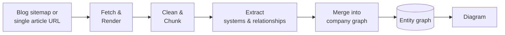

# pyro Architecture

Big-picture design doc: what pyro does and how the pieces fit together conceptually. For setup
and usage, see the root [README](../README.md).

## What this is

pyro turns a company's engineering blog into a system map: a single diagram of the services,
datastores, queues, and external systems that blog has ever described, and how they relate. It
crawls a blog's posts and, as more come in, merges what each one describes into one growing,
company-wide graph — not a per-post summary. The value is in the assembly: a graph built from
years of posts can show that a queue introduced in one post is the one a later post says got
replaced, in a way no single post could.

## High-level flow

Every post moves through the same stages every time. The pipeline is stateful and idempotent —
each post's progress is tracked, so re-running only processes what hasn't finished, which makes
it safe to re-point at a growing blog repeatedly instead of one big all-or-nothing run.

## The layers

**Ingestion** discovers or takes a post URL and renders it in a real browser (many engineering
blogs are client-side rendered), deduplicated by normalized URL.

**Cleaning** strips boilerplate and chunks unusually long posts so each fits a model call.

**Extraction** reads each cleaned post in isolation and pulls out its systems (service,
datastore, queue, external system, team) plus the relationships it explicitly states, each system
tagged with a domain from a fixed list. Posts are read independently at this stage — nothing here
knows a system is the same one another post already named differently.

**Model routing** sends every extraction/merge call through a prioritized list of providers
(several free tiers first, paid last), retrying the same tier on rate limits and falling through
to the next on outright failure. This keeps the pipeline cheap and lets it degrade gracefully
instead of stopping when one provider is unavailable.

**Merge** is where reconciliation happens — the layer above can't do it, since each post is
extracted alone. It folds each post's systems into the company's one running graph, one post at a
time (never in parallel, since each post's name resolution needs to see what prior posts in the
same run already settled). Resolution is two-tier: a free deterministic string-match pass first,
then an LLM call only for names it can't settle, shown just the most-similar known names so the
prompt stays a fixed size as the graph grows. A company's graph only ever has one merge running
against it at a time, enforced by a per-company lock shared by every entry point.

**Storage** keeps three things in ArangoDB, all scoped by company: each post's pipeline progress,
the resolved systems, and the resolved relationships as graph edges (not flat rows), so
connection-following questions are answered by graph traversal. Relationship types are drawn from
a fixed vocabulary so "sends requests to" and "calls" store as one edge type, not two — the
model's original wording is kept alongside the canonical form.

**Dashboard** triggers runs and shows a live diagram of a company's current graph. A submitted run
gets a one-shot acknowledgment, not a progress view — each run's full transcript is written
straight to ArangoDB's `jobs` collection as it happens instead.

**Scheduling** re-runs merge on a recurring schedule; a company with nothing pending is a fast
no-op, so this is what keeps a company's graph caught up without manual triggering.

## Configuration philosophy

Three concerns stay separate: **secrets** (env only, never checked in), **tuning** (checked-in
plain config, reviewed like code), and **prompt content** (its own editable text, so refining a
prompt never touches config or code).

## Known limitations & deliberate tradeoffs

- **Run history has no dashboard page and is single-instance.** Durable in ArangoDB's `jobs`
  collection, inspected directly rather than rendered in the UI; the in-memory job state is still
  process-local, so this can't scale past one dashboard instance yet.
- **Name resolution is a judgment call, not a guarantee.** Two posts describing the same system in
  genuinely different words may end up as two nodes — deliberately conservative, since a wrong
  merge is worse than a missed one.
- **The diagram is a whole-company snapshot**, interactive (pan/zoom, expand/collapse, `composes`
  nesting) but not filterable — a merge-prompt change means deleting and re-merging to rebuild it.
- **Automated checks aren't enforced on every change** — tests exist and pass but aren't gated in CI.

## Extending the system

- A new model provider is additive to the routing layer's priority list.
- A new extraction prompt style can be added alongside the existing one and selected per run.
- **Cross-company comparison** — the reason the domain tag exists — is the natural next layer:
  once several companies each have a graph, shared domain tags become the alignment point.
