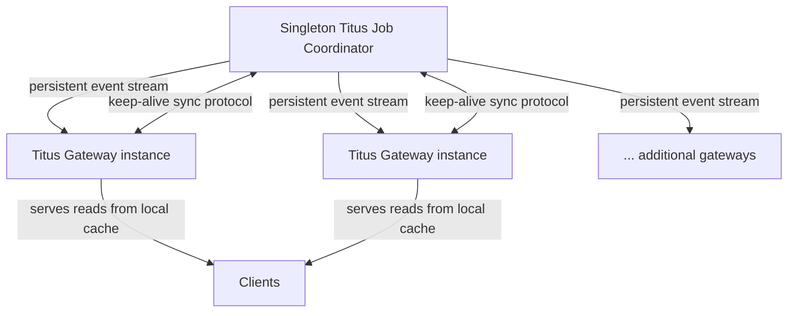
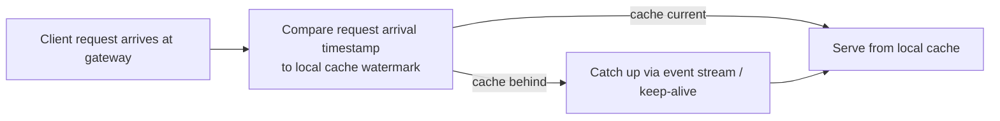

# Netflix: Compute Orchestration

The single engineering post in this domain describes a defining tension in Netflix's Titus container orchestration platform: the control plane's API layer must serve live state to clients with strong consistency, yet the system that owns that state is a single logical leader. As traffic grew, the naive architecture — route every active-data query through the singleton job coordinator — stopped scaling. The article is a case study in how Netflix chose to scale out the read path horizontally while preserving the exact consistency guarantees clients had come to depend on. That one problem, and its resolution, is the whole story this domain tells.

## Big Picture: Compute Orchestration Topology

The topology below is the system as the article describes it: a singleton leader that owns authoritative job state, a set of horizontally scalable gateway instances that front clients, and a replication mechanism that keeps the gateways' local caches consistent with the leader.

## Scaling the Titus API Layer Without Sacrificing Consistency

The article's core problem is a classic one, stated with unusual clarity. In the original Titus architecture, all active-data queries — reads of job state, task state, and similar live information — were routed through the singleton Titus Job Coordinator. That coordinator was the single source of truth, which made consistency trivially simple: every client read hit the authoritative state directly. But it also made the coordinator the bottleneck. As API traffic grew, the coordinator experienced increased latencies and dangerously high server utilization, and the architecture was no longer viable.

The hard constraint was that the consistency guarantees could not be relaxed. Clients depended on read-your-writes and monotonic reads — a client that issues a write and then reads must see its own write, and a client that reads a state at time T must not later see an older state. The challenge was to scale out reads across many gateway instances without breaking those guarantees.

The solution is a replication-and-catch-up design that keeps the gateways as the sole read path while guaranteeing they serve state that is current with respect to the moment each request arrives. Each Titus Gateway maintains a local cache that is kept in sync with the leader via a persistent event stream — the leader publishes every state change, and each gateway consumes that stream to update its cache. This alone gives eventual consistency, which is not enough. The key addition is a keep-alive synchronization protocol built on high-resolution logical timestamps. The leader and the gateways exchange keep-alive messages that carry these timestamps, so each gateway knows exactly how fresh its cache is relative to the leader — effectively a watermark of the last state change it has incorporated.

The crucial step happens at request time. Before serving a client request, the gateway checks whether its cache includes all state changes that occurred up to the request's arrival time. If the cache's watermark is behind that arrival timestamp, the gateway first catches up — pulling any missing events from the stream or waiting for the keep-alive protocol to confirm freshness — and only then serves the read from its local cache. This is what preserves read-your-writes and monotonic reads: a request is never served from state older than the moment the client issued it, so any write the client made before that moment is guaranteed to be visible.

The design is elegant because it moves the consistency burden from the data path to the synchronization protocol. The gateway does not need to ask the leader for each read — it only needs to know, cheaply and continuously, how current its local copy is. The persistent event stream provides the replication; the keep-alive protocol provides the freshness signal; the arrival-time check provides the consistency guarantee. The result is that the API layer can scale horizontally — more gateways, more caches — without ever reintroducing the singleton as a read bottleneck.

## Other Topics in This Domain

The dataset contains only this single article, so there are no thin one-off topics to summarize separately. Everything in scope is covered in the deep-dive above.

## Cross-Cutting Patterns

With only one article in this domain, there are no patterns that can be evidenced across multiple posts. The one pattern that does stand out internally is the general approach of replicating authoritative state outward via an event stream and using timestamp-based freshness checks at the read boundary — a reusable template for any control plane that needs to scale reads while preserving strict consistency. It is worth noting as the architectural signature of this design, even though it is drawn from a single source rather than corroborated across the corpus.