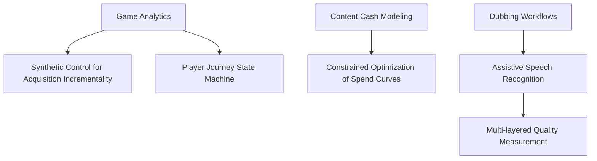

# Netflix: Data Platform

The work surfaced in this domain survey reveals a single recurring difficulty: several of Netflix's most important business questions cannot be answered through direct measurement or standard experimental design. Acquisition campaigns for games have no natural control group, cash requirements must be forecast for content that is not yet fully specified, and dubbing transcription quality resists any single evaluation metric. The analytics engineering team responds by substituting model structure for missing ground truth — synthetic controls, state machines, constrained optimization, and assistive speech recognition each impose a formal framework where the data alone cannot settle the question.

## Big Picture: Data Platform Topology

## Deep-Dive: Game Analytics — Measuring What Cannot Be Measured Directly

The richest problem space in the survey is game analytics, where the team confronts two separate measurement gaps and builds two different kinds of models to close them.

The first gap is incrementality. When Netflix runs user acquisition campaigns for games, the central question is whether the campaign actually produced new signups that would not have happened anyway. The difficulty is that there is no control group — you cannot simply withhold advertising from a comparable population and compare outcomes. The team's answer is a synthetic control framework: instead of relying on a randomized experiment, they construct a counterfactual comparison from observational data, modeling what the acquisition rate would have been absent the campaign and attributing the difference to the campaign itself. The same logic is extended to estimating incremental signups, where the goal is to distinguish users acquired because of a specific initiative from those who would have signed up organically. The reasoning is that the counterfactual is never observed, so it must be estimated; synthetic control imposes enough structure on the estimation problem to make the attribution defensible.

The second gap is engagement. Even after signups are attributed, the team wants to understand how players progress through the product — where they start, what keeps them playing, and where they drop off. Their solution is a player journey state machine: the player's relationship with the game is modeled as a set of discrete states with defined transitions, so that engagement can be analyzed as movement through the state space rather than as an undifferentiated count of activity. This gives the team a shared vocabulary for funnel analysis and lets them ask questions about which transitions are healthy and which are loss points.

Taken together, the two models cover the full arc of game analytics: synthetic control answers "did we acquire the right users?" and the state machine answers "what did those users actually do?"

## Other Topics in This Domain

| Topic | Problem | Solution |
|---|---|---|
| Content cash modeling | Forecasting cash needs for content titles that are not yet specified, making direct estimation impossible | Constrained optimization models that produce cash spend curves, trading off constraints on timing and availability |
| Dubbing workflows | Improving transcription efficiency in the dubbing pipeline, where ML output must be trusted before it is used | Assistive speech recognition paired with a multi-layered measurement framework that evaluates transcription quality from several angles rather than a single score |

## Cross-Cutting Patterns

Because this document is drawn from a single survey post, no claims can be made about patterns repeated across separate posts. Within the survey itself, however, three motifs recur across otherwise unrelated projects. First, model structure stands in for missing data: synthetic control, the state machine, and constrained optimization all impose formal structure precisely where the underlying information is incomplete or absent. Second, measurement is layered on top of models rather than taken as given — the ASR work pairs its system with a multi-layered evaluation framework, and the acquisition work validates its synthetic control against the logic of counterfactual reasoning. Third, the dominant statistical toolkit is optimization and causal inference rather than descriptive analytics; every project in the survey is fundamentally about estimating something that cannot be observed directly.