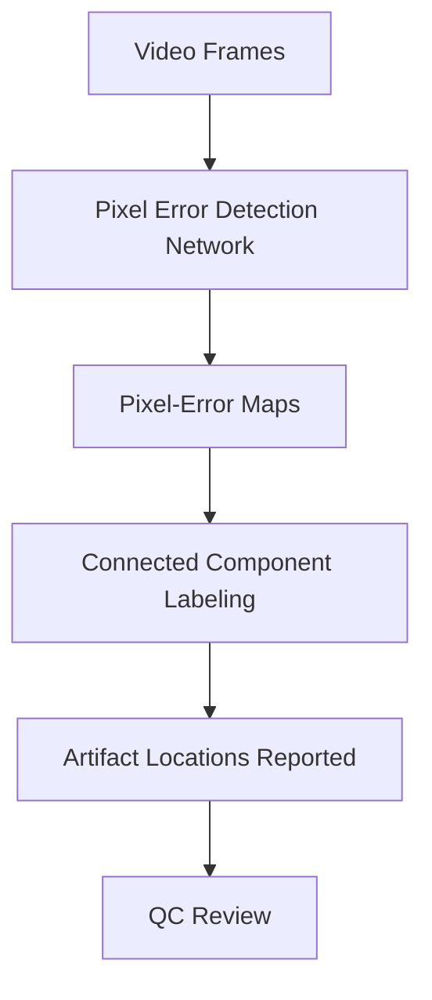

# Netflix: Media/Content Pipeline

The single documented article in this domain exposes a core tension in media delivery: quality control must be thorough enough to catch artifacts that degrade the viewing experience, yet automated enough to run at Netflix's scale. Frame-by-frame human inspection breaks down for a specific class of defects — hot pixels, tiny bright spots that appear in isolated frames — precisely because they are small, rare, and easy to overlook. The engineering team's answer is to replace that manual check with a bespoke neural network trained to flag these artifacts programmatically, turning a painstaking visual task into a deterministic pipeline stage.

## Big Picture: Media/Content Pipeline Topology

This flow reflects what the article describes: five consecutive frames at full resolution feed a neural network, which emits per-pixel error maps; connected component labeling then converts those maps into concrete, reportable artifact locations for QC follow-up.

## Deep-dive: Automated Pixel Error Detection in Video Quality Control

The motivating problem is straightforward but severe. Manual video quality control is painstaking and error-prone, and hot pixels are the worst case: a single bright spot in a single frame can be missed by a human reviewer, and the oversight only becomes costly later in the pipeline. Because the artifact is so small and transient, it defeats the natural human tendency to scan for obvious, large-scale defects.

The solution is a neural network purpose-built for this detection task. Instead of classifying whole frames as good or bad, the network operates at full resolution on a sliding window of five consecutive frames — the temporal context matters, because a genuine hot pixel is a stable bright spot whose persistence across frames distinguishes it from noise or legitimate scene content. The network's output is not a verdict but a pixel-error map: a per-pixel signal indicating where an artifact is present. That map is then run through connected component labeling, which groups adjacent flagged pixels into discrete regions and reports their locations, giving QC reviewers exact coordinates to check rather than a vague "something looks off" signal.

The training strategy is notable for its pragmatism. Because real-world hot pixels are rare and laborious to label, the model is initially trained on synthetically generated hot pixels — giving the network a dense, controlled supply of positive examples. It is then iteratively refined on real-world data, with the explicit goal of reducing false positives while maintaining high recall. This two-stage approach acknowledges that the synthetic distribution is only an approximation of reality: the model must be re-anchored to genuine production artifacts, and the tuning priority (precision over raw recall) reflects the operational cost of false alarms — every false positive is a QC reviewer's time spent chasing a non-issue.

The overall design is a clean separation of concerns: a learned detector handles the perceptual part of the task (seeing the artifact), and a classical image-processing step (connected component labeling) handles the geometric part (localizing and grouping it). This division keeps the neural network focused on what it does well, and keeps the reporting deterministic and interpretable for the human reviewers downstream.

## Cross-Cutting Patterns

With only a single article in this domain, no cross-article architectural patterns can be evidenced. The one article does suggest a direction worth watching — the replacement of manual, frame-by-frame inspection with learned, automated detection, and the use of synthetic data to bootstrap training where real positives are scarce — but that is a single observation, not a repeated theme, and any claim of an emerging pattern would be speculative.