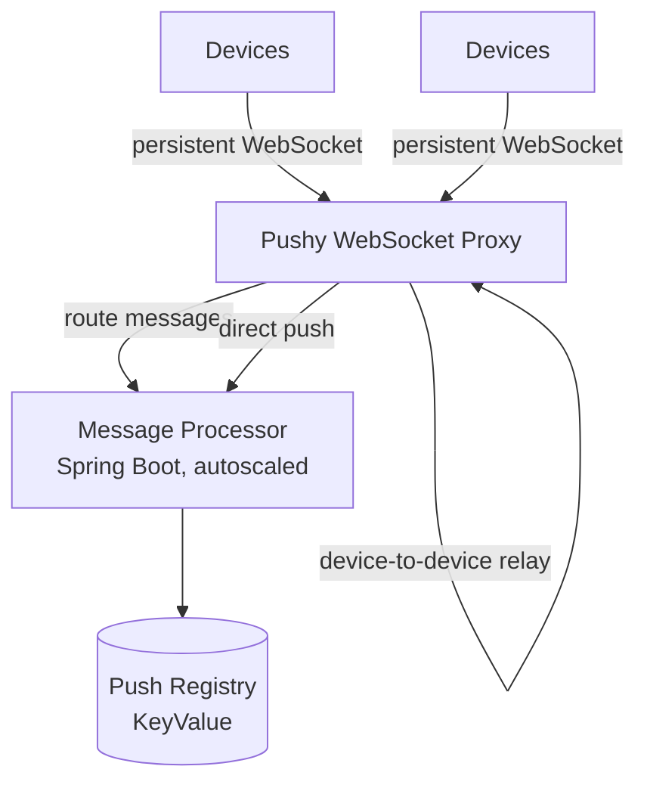
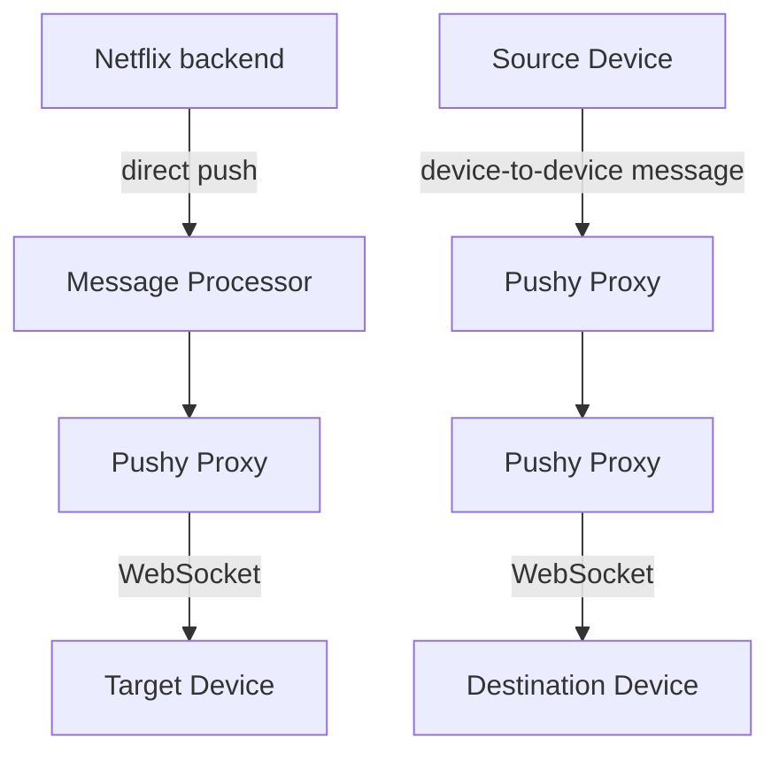

# Netflix: Messaging & Real-Time

The single post in this corpus traces the evolution of Pushy, Netflix's WebSocket proxy that sits between the backend and hundreds of millions of devices, holding persistent connections open so messages can be delivered the moment they exist. The domain's core tension is visible in one arc: stateful, long-lived connections are fundamentally different from request/response traffic, yet they must scale with the same operational discipline. Every scaling decision — which registry, how many connections per node, how fast to add capacity — has to contend with the fact that a connection is a piece of state, and moving or dropping it is visible to the user.

## Big Picture: Messaging & Real-Time Topology

The topology is a classic front-proxy for connections: devices hold a WebSocket to Pushy, and Pushy holds enough state to know where each device is. The message processor brokers delivery, and the registry — historically Dynomite, now KeyValue — holds the mapping of device to connection. The newer direct-push and device-to-device paths extend this same topology without changing its shape.

## Pushy: Scaling the Connection Plane

The central problem the team attacked is the difference between tens of millions and hundreds of millions of concurrent connections. At tens of millions, manual scaling of the message processor and the Dynomite registry is tolerable; at hundreds of millions, it is not. Scaling a connection plane is harder than scaling a request plane because the cost of a mistake is not a retried request but a dropped connection that the device must re-establish — and if every reconnecting device hits the proxy at once, the result is a thundering herd that can take the whole plane down.

The team's solution was to treat the connection plane like a distributed system with explicit capacity management. The message processor was rewritten as a Spring Boot service with autoscaling and canary deployments, so capacity could grow and shrink without operator intervention and changes could be validated on a small slice of traffic. The Push Registry was migrated from Dynomite to KeyValue, removing a scaling bottleneck in the metadata layer. On the proxy side, instance types were reevaluated to triple the number of connections a single node can carry — a straight capacity win — and autoscaling was made exponential rather than linear, so the fleet could absorb a spike in reconnects without the herd effect. Reliability came from heartbeats and connection cleanup, which detect dead peers and release their resources instead of letting stale state accumulate.

What's notable is how deliberately the team sequenced these changes: capacity first (instance types), then automation (autoscaling, canaries), then consistency of state (registry migration), then hygiene (heartbeats, cleanup). Each step removes a constraint that would have made the next step unsafe.

## Evolving the Protocol: Direct Push and Device-to-Device Messaging

Once the connection plane could hold hundreds of millions of connections reliably, the team turned the same infrastructure toward new use cases: direct push — the server pushing a message to a specific device on demand — and device-to-device messaging, where one device addresses another. These are not new connection types; they are new routing policies over the same WebSocket fabric.

The solution is a JSON-based protocol layered on the existing WebSocket connection, with caching to avoid repeated lookups of device state and security checks to ensure a device can only address targets it is allowed to reach. The design choice is to keep the proxy dumb and the protocol explicit: the proxy relays structured messages, and the policy — who may push to whom — lives in the security checks rather than in per-connection logic.

## Other Topics in This Domain

The sole post in this corpus is fully covered by the two sections above; there are no thin, one-off topics to summarize separately.

## Cross-Cutting Patterns

Evidence for this domain is a single post, so the patterns below are ones the team applied repeatedly within Pushy's own evolution rather than patterns observed across separate posts. Three hold up. First, capacity is a prerequisite for reliability: the team tripled per-node capacity before adding automation, understanding that autoscaling on a weak base just amplifies failure. Second, state must be treated as a first-class scaling problem: the registry migration from Dynomite to KeyValue and the heartbeat/cleanup work both acknowledge that a connection plane is only as healthy as its metadata and its dead-connection reclamation. Third, change is gated by canaries and exponential autoscaling, which together let the team grow the fleet fast without ever letting the whole fleet change at once. These are the operational habits that let a WebSocket proxy outgrow its original design without outgrowing its operators.