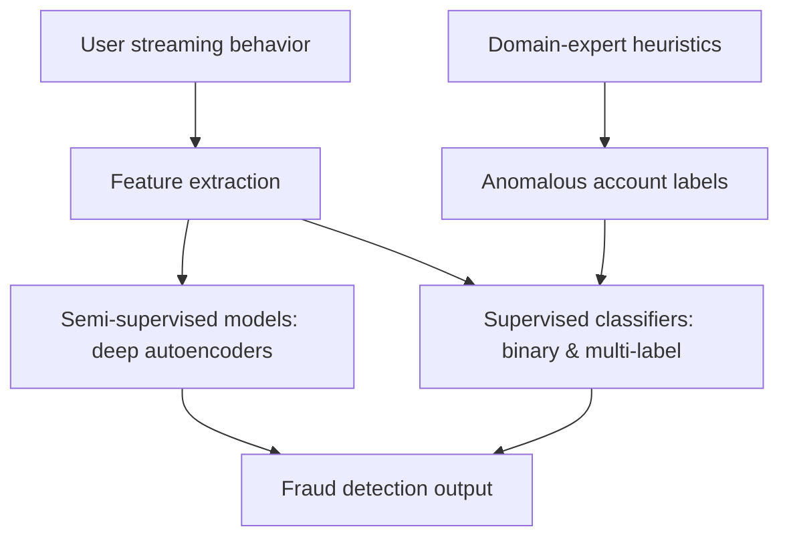

# Netflix: ML/Detection

The single article in this domain reveals a problem that recurs across streaming platforms: fraud is not one thing but many. Content fraud, service fraud, and account fraud each present differently in user behavior, and they all need to be caught at scale and in near-real-time without drowning the team in false positives. The article's core thesis is that rule-based detection — the traditional first line of defense — does not scale: rules are expensive to author, brittle as fraudsters adapt, and require constant expert supervision to stay current. The engineering response documented here is a shift to machine learning, but with a pragmatism that matters: instead of chasing fully unsupervised anomaly detection, the team uses domain-expert heuristics to bootstrap labels, then layers semi-supervised and supervised models on top. The result is a detection stack that learns from the same behavioral signals rules used to encode by hand, but without the manual maintenance burden.

## Big Picture: ML/Detection Topology

## Deep Dive: The Fraud Detection Pipeline for Streaming Services

The only article in this dataset describes what is effectively a single end-to-end pipeline, and it is the richest material in the domain. The problem it addresses is the classic fraud-detection squeeze: fraud is rare, adversarial, and heterogeneous, so labeled data is scarce; meanwhile, the cost of detection errors is asymmetric — missing a fraudster is worse than inconveniencing a legitimate user, but over-blocking legitimate users erodes trust in the service.

The solution is structured around three decisions that are worth unpacking because they reveal the team's reasoning.

First, labeling. The team does not attempt to hand-label accounts or rely on user reports. Instead, domain experts define heuristics that flag anomalous accounts. These heuristics are not the final detection mechanism — they are a labeling mechanism. This is a subtle but important distinction: the heuristics are allowed to be noisy and incomplete because their job is to produce training signal, not to be the production detector. This bootstrapping step turns an unsupervised problem (find fraud) into a supervised one (learn from expert-flagged accounts), which is what makes the rest of the pipeline tractable.

Second, features. The article describes extracting features from user streaming behavior. This is the raw material both model families consume. The choice of behavioral features — rather than, say, account metadata alone — is consistent with the fraud taxonomy: content fraud, service fraud, and account fraud each leave different behavioral traces, and the feature set needs to be rich enough for a model to distinguish them.

Third, the model architecture is deliberately two-pronged. Semi-supervised models, specifically deep autoencoders, are trained on the behavior of accounts that the heuristics did *not* flag. The autoencoder learns to reconstruct normal behavior; accounts with high reconstruction error are anomalous by definition — they deviate from the learned norm. This catches fraud that the expert heuristics never anticipated, which matters in an adversarial setting where fraudsters actively probe for blind spots. In parallel, supervised classifiers — both binary and multi-label — are trained on the heuristic-labeled accounts. The binary variant answers "is this account fraudulent?" while the multi-label variant answers "which type of fraud is this?" — content, service, or account. The multi-label formulation is a strong design choice because it forces the model to learn the *taxonomy* of fraud, not just a single boundary, which in turn makes downstream triage and response more actionable.

The two model families are complementary rather than redundant: the supervised classifiers are precise on known fraud patterns (where the heuristics provided signal), and the autoencoder is broad on novel patterns (where no labels exist). Together they cover the detection space that rules alone could not.

## Other Topics in This Domain

The dataset contains only this single article, so there are no thin one-off topics to summarize separately. Everything in the domain reduces to the fraud detection pipeline described above.

## Cross-Cutting Patterns

With only one article in the sample, no cross-post patterns can be established — there is no second post to corroborate or contradict the approaches described. Within the single article, however, two design instincts stand out as likely signatures of how this team approaches ML/Detection problems: the use of expert heuristics as a labeling bootstrap rather than as the production mechanism, and the deliberate pairing of a semi-supervised model (for novelty) with supervised models (for precision on known fraud types). Whether these are company-wide patterns or specific to this one team's fraud work cannot be determined from this sample alone.