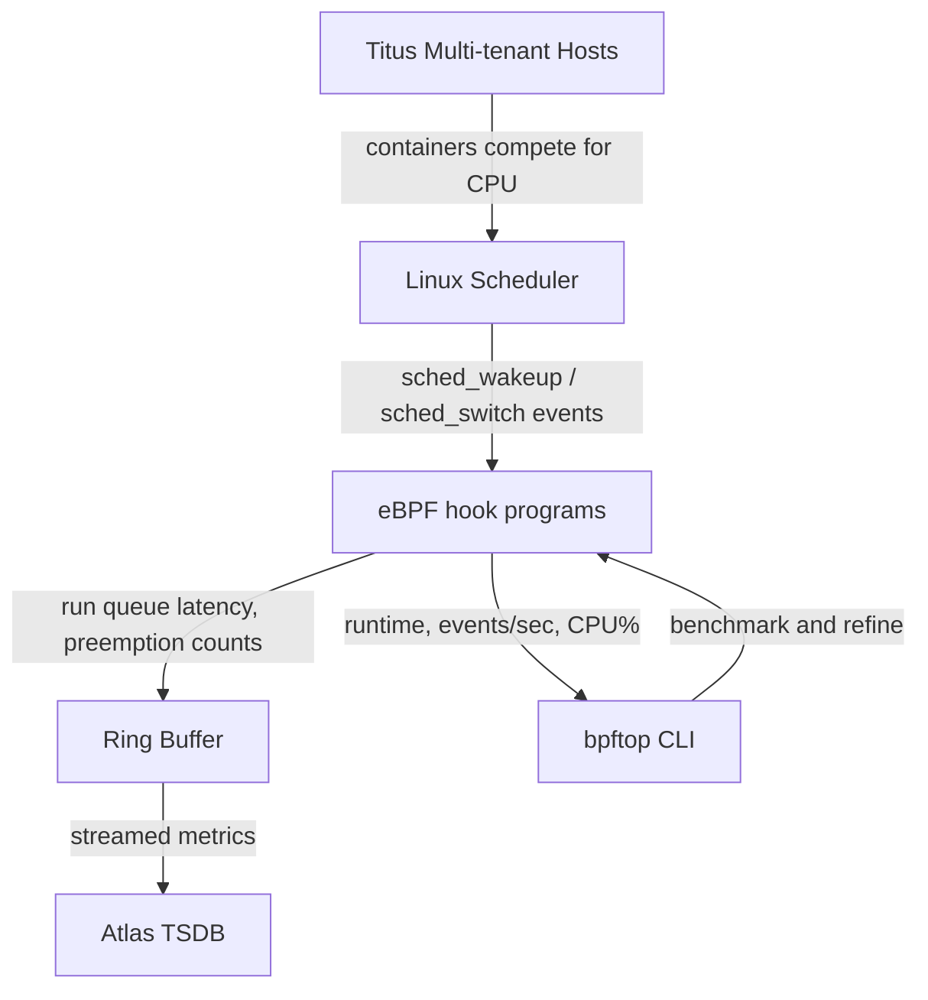
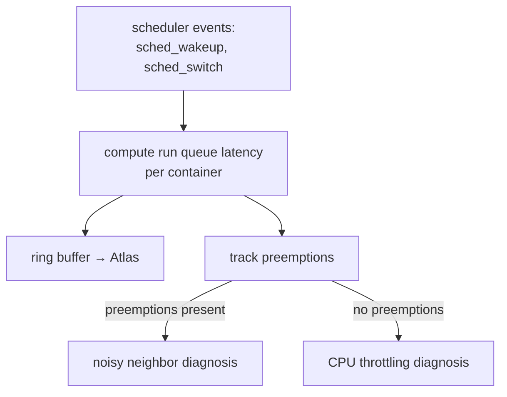

# Netflix: Observability

Across Netflix's engineering posts in this domain, a single theme recurs: the platform team is betting on eBPF as the connective tissue between kernel-level events and operational insight. Two problems motivate this. On the multi-tenant Titus container platform, a single CPU-hungry container — a "noisy neighbor" — can silently degrade every container sharing its host, and the classic toolchain (profiling with `perf`, on-demand investigation) is too heavy to run continuously and deployed too late to catch transient issues in action. The second problem is subtler: the eBPF programs built to solve such problems are themselves performance-sensitive, and a scheduler hook that adds real CPU overhead is worse than the failure it diagnoses. The team's answer is a two-layer observability strategy — always-on eBPF instrumentation that streams scheduler metrics into Atlas, plus a dedicated CLI tool that makes the performance of those eBPF programs visible and optimizable in real time.

## Big Picture: Observability Topology

## Deep Dive: Scheduler-Level Noisy Neighbor Detection via eBPF

The noisy neighbor problem on Titus is a classic shared-host failure mode: a container or system service that saturates CPU causes adjacent containers to wait in the run queue, and the degradation is invisible until users notice. The conventional response — attaching `perf` or a similar profiler after symptoms appear — fails on two counts: the tool is too heavy to run continuously in production, and by the time degradation is reported, the offending workload has often already finished its burst. The team's framing here is really about *when* observation happens: it must be continuous, cheap, and always-on, not reactive.

The solution instruments the Linux scheduler itself with eBPF. The team hooks two scheduler events — `sched_wakeup` and `sched_switch` — and from those events computes a per-container run queue latency: the time a container's thread spends waiting on the run queue before being scheduled. That metric is written to a ring buffer and streamed to Atlas, so it lands in the same time-series infrastructure as every other platform metric rather than in a separate profiling silo.

The subtle part of the design is the distinction the team drew between two failure modes that look identical from outside. Slowness caused by a neighbor hogging CPU is a noisy neighbor case, but the same symptom can be caused by CPU throttling — the container's own resource limits being enforced. Both manifest as increased run queue wait, yet the remedies are completely different: the first calls for evicting or rebalancing a neighbor, the second for adjusting the container's quota. By also tracking preemptions — cases where a running thread is forcibly descheduled by a higher-priority thread — the team can separate the causes: preemptions point at a noisy neighbor, while pure run queue wait without preemption points at throttling. That distinction is the difference between an alert that says something is wrong and an alert that says what to do about it.

The choice of eBPF over alternatives is what makes this design practical: it provides kernel-level event visibility at a cost low enough to run continuously on every host, and it feeds the same Atlas pipeline as the rest of the platform's metrics — so noisy neighbor detection becomes part of the standard operational picture, not a special investigation tool.

## Deep Dive: bpftop — Making eBPF Programs Observable to Their Own Developers

The quiet irony of the first section is that the tools Netflix now deploys to observe the scheduler are themselves eBPF programs, and eBPF programs are not free. A hook that fires on every context switch adds measurable CPU overhead to a host, and an unoptimized program — a costly hash map lookup in the hot path, an unnecessary helper call — multiplies that cost across thousands of hosts. The team's problem in optimizing these programs was process rather than capability: benchmarking an eBPF program traditionally meant manually computing metrics like execution runtime, events per second, and CPU usage, then reasoning about where the hot path was. That is slow, error-prone, and out of step with the iterative refinement loop a developer wants when tuning a kernel hook.

bpftop is the team's answer: a command-line tool that displays real-time statistics for running eBPF programs in a top-like table, with an option to switch to time-series graphs. A developer can watch the runtime and event rate of a program live, make a change, and see the effect immediately — the same feedback loop `top` gives for host processes, but applied to eBPF programs. The design detail worth noting is the overhead minimization: bpftop gathers statistics only while it is actively displaying them, so the measurement tool itself does not perturb the programs it measures when no one is looking. That is the same discipline the noisy neighbor work applies to the scheduler hooks — the observation layer must be cheaper than the failures it detects, or it becomes a failure itself.

The two articles in this domain form a matched pair: the noisy neighbor work shows how eBPF serves as the observability layer for the platform, and bpftop shows how Netflix keeps the observability layer itself observable.

## Other Topics in This Domain

Both articles in this domain are covered in the deep dives above; there are no thin one-off topics warranting a separate summary.

## Cross-Cutting Patterns

Two patterns recur across both posts, and they are the reason the team's approach holds together. The first is the *always-on, low-overhead inspection* principle: Netflix rejects reactive, post-hoc tooling (profiling after symptoms, manual benchmarking) in favor of continuous instrumentation cheap enough to be a permanent part of the platform. The second is the *measurement of the measurement*: the team treats the observability layer itself as a performance-critical system — bpftop exists to make eBPF programs visible to their developers, and the scheduler hooks are designed to be inexpensive enough to run everywhere. That self-reference — observability tooling that observes its own observers — is the thread tying these two posts together, and it signals a mature practice: once the team began worrying about the performance of its performance tools, monitoring had ceased to be an afterthought.