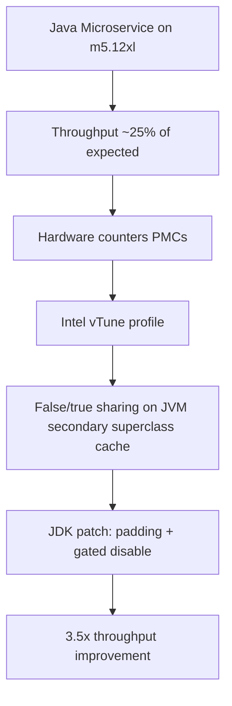

# Netflix: Other

The single post in this domain captures a classic performance-engineering failure mode at Netflix scale: hardware gets bigger, but software doesn't follow. A Java microservice migrated to a larger AWS instance (m5.12xl) expecting roughly 3x throughput and instead saw ~25% — with worse latency and a puzzling bimodal distribution of CPU and latency across nodes. What looks like a capacity problem turns out to be a JVM-internal cache-coherence problem, solvable only by going below the application layer into hardware counters and the JDK source itself. The article is a case study in how deep instrumentation — not load testing or profiling at the method level — is required when the bottleneck lives between the JVM and the CPU.

## Big Picture: Other Topology

## Deep-dive: The m5.12xl Scaling Mystery — False Sharing in the JVM's Secondary Superclass Cache

The article's problem statement is precise: after migrating a Java microservice to an m5.12xl instance, throughput improved only ~25% instead of the expected ~3x, and latency degraded. Critically, CPU and latency distributions became bimodal across nodes — some nodes behaved well, others poorly, which ruled out a simple contention or saturation story and pointed toward a per-node, per-core interaction effect.

The team's first move was to stop guessing and start measuring at the hardware level. They used Performance Monitoring Counters (PMCs) and Intel vTune to profile the service. This is the key methodological point: standard Java profilers would not have revealed the issue, because the bottleneck was not in application code or even in JIT-compiled hot paths, but in the JVM's internal data structures interacting with CPU cache coherency.

vTune identified two related phenomena on the JVM's secondary superclass cache:

- **False sharing**: threads on different cores writing to different entries that happen to live on the same cache line, causing cache-line ping-ponging and massive coherence traffic.
- **True sharing**: threads actually accessing the same cache line, implying the cache itself was a genuine hotspot.

The secondary superclass cache is an internal JVM structure used to speed up class hierarchy lookups — not something application developers typically think about, and certainly not something visible via application-level profiling. But at Netflix's concurrency levels, the cache-line contention on this structure became the dominant cost.

The fix was a JDK patch. The team first added padding to the cache entries to eliminate false sharing — aligning entries so that distinct entries occupy distinct cache lines. This addressed the ping-ponging but left the true-sharing component. They then went further and disabled writes to the cache entirely, gated behind a flag so it could be toggled at runtime or per-deployment. The result: 3.5x throughput improvement — exceeding the original 3x expectation.

The engineering lesson here is twofold. First, hardware counters are the right tool when scaling behavior diverges from expectations in ways that vary across nodes — they expose cache-coherency traffic that higher-level tools cannot. Second, the willingness to patch the JDK itself, rather than work around the problem in application code, is what turned a 25% scaling failure into a 3.5x win. The gated flag is notable: it shows the team shipped the fix conservatively, keeping the ability to revert the behavior change in production if something unexpected surfaced.

## Other Topics in This Domain

This domain currently contains a single article, which is fully covered in the deep-dive above. There are no additional one-off topics to summarize.

## Cross-Cutting Patterns

With only one post in this domain, no cross-article patterns can be established with confidence. The article itself, however, evidences a pattern that would likely recur across Netflix engineering: when application-level profiling fails to explain a performance regression, the investigation descends to the hardware layer — PMCs, cache-line behavior, JVM internals — and the fix is applied at the JDK level rather than in service code. The gated flag approach also suggests a broader operational discipline: ship fixes that can be toggled off in production without a redeploy. These are single-data-point observations, not confirmed patterns, and would need more posts in this domain to validate.