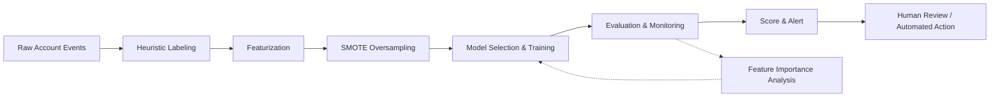

# ML Fraud Detection in Streaming

## Overview

Netflix's streaming platform operates at scale and therefore faces a broad and evolving set of fraud and abuse attempts. Rule-based detection alone proved insufficient for real-time, large-scale operation, leading to the development of an ML-based fraud detection system. The system continuously scores accounts for anomalous behavior, feeding both automated responses and human review workflows. This document captures the architecture, methodology, and key findings from the initial deployment as described in the Netflix TechBlog article.

## Fraud Categories

The system tracks three principal categories of fraud and abuse:

- **Content fraud** – attempts to acquire or view content outside the terms of service, such as credential sharing or unauthorized access.
- **Service fraud** – abuse of the service itself, including ToS violations like account reselling or bulk account creation.
- **Account fraud** – compromised accounts, stolen credentials, or account takeover.

These categories are not mutually exclusive; a single account may exhibit behavior associated with multiple types, which motivates a multi-label classification approach.

## Labeling Strategy

No pre-existing labeled datasets were available for fraud. The team therefore designed a set of heuristic, rule-based labeling functions in collaboration with security experts. These functions automatically flag accounts as either anomalous or benign based on observable behaviors, such as:

- Rapid license acquisition within a short time window.
- An unusually high number of failed streaming attempts.
- Unusual combinations of device type and DRM activity.

The team acknowledges that heuristic labeling can introduce false positives (e.g., buggy clients triggering anomaly rules) and that the model's role is to learn to generalize past such labeling noise, capturing the underlying behavioral patterns rather than merely memorizing the rules.

## Feature Engineering

The feature set comprises 23 daily-aggregated features divided into two classes:

1. **Count features** – daily counts of distinct occurrences, such as distinct titles viewed, distinct devices, distinct DRMs, and license counts.
2. **Percentage features** – daily percentages of usage, such as the proportion of playback on a given device type.

Features are partially obfuscated for confidentiality, and are intentionally designed to be compute-efficient for daily batch processing. The training dataset contains roughly 1.03 million benign accounts and 28,000 anomalous accounts over a 30-day observation window.

## Handling Class Imbalance

The dataset is heavily imbalanced (approximately 36:1 benign-to-anomalous). To address this, the team applied **SMOTE** (Synthetic Minority Over-sampling Technique) to oversample the minority classes prior to model training. SMOTE generates synthetic examples by interpolating between existing minority-class samples, improving the model's ability to learn decision boundaries for rare but critical fraud patterns.

## Model Approaches

The team evaluated three families of approaches:

### Semi-Supervised / One-Class Models

Because heuristic labels were noisy at the outset, anomaly detection models were trained on unlabeled (predominantly benign) data to identify outliers. Models tested include One-Class SVM, Isolation Forest, Elliptic Envelope, and Local Outlier Factor. A **deep auto-encoder** performed best among these, achieving approximately 96% accuracy and 94% F1-score, and served as a strong baseline for downstream supervised models.

### Supervised Binary Classification

Once heuristic labels were confident enough, the problem was framed as binary classification (benign vs. anomalous). A dozen supervised classifiers were compared, including SVC, k-NN, Decision Tree, Random Forest, Gradient Boosting, AdaBoost, QDA, Gaussian Naive Bayes, Gaussian Process, Label Propagation, and XGBoost. Hyperparameters were tuned via grid search with stratified k-fold cross-validation. XGBoost and Random Forest consistently ranked among the top performers.

### Supervised Multi-Label Classification

To capture the possibility of an account exhibiting multiple fraud types simultaneously, the team also formulated the problem as multi-class multi-label classification. Models evaluated include k-NN, Decision Tree, Extra Trees, Random Forest, and XGBoost, with appropriate multi-label adaptation strategies.

## Evaluation Metrics

- **Binary / one-class**: accuracy, precision, recall, F0.5/F1/F2 scores, and ROC AUC.
- **Multi-label**: exact match ratio, Hamming loss, and Hamming score, which better reflect partially-correct multi-tag predictions.

These metrics were chosen to balance the cost of false positives (unnecessary friction for legitimate users) against false negatives (missed fraud).

## Feature Importance Findings

Analysis of feature importance across fraud categories revealed clear separation:

- **Content fraud** – dominated by distinct encoding formats, distinct devices, and distinct DRMs, indicating attempts to circumvent content protection or access a wide range of titles across unusual device combinations.
- **Service fraud** – driven by license count, distinct devices, and percentage usage of a specific device type (labeled "device type (a)"), suggesting patterns of bulk provisioning or account reselling.
- **Account fraud** – overwhelmingly driven by distinct device count, consistent with account takeover scenarios where an attacker uses a compromised account across many devices within a short period.

These findings provide actionable insight for targeted feature engineering and for designing more interpretable rule-based fallbacks where ML confidence is low.

## End-to-End Pipeline

The overall pipeline operates as a daily batch job:

1. **Heuristic labeling** generates pseudo-labels for all accounts.
2. **Featurization** computes the 23 daily features.
3. **SMOTE** oversamples the minority class to balance training data.
4. **Model training/evaluation** occurs offline, with periodic retraining as new labeled data accumulates.
5. **Feature importance analysis** informs both model refinement and business rule adjustments.

## Relationship to Other Systems

This ML pipeline runs alongside the broader data engineering infrastructure at Netflix, consuming the same event streams that feed analytics and personalization systems. It is intentionally decoupled from real-time serving to allow for robust offline evaluation and model governance, though the feature set is designed to be computable in real time for future deployment.

## Future Work

The article references an underlying technical paper for deeper algorithmic detail. Ongoing efforts focus on reducing labeling noise, expanding feature coverage, and exploring online learning to adapt to new fraud patterns as they emerge.