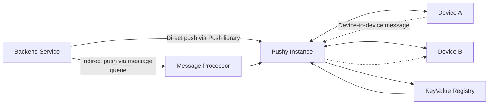

# WebSocket Messaging Infrastructure

Netflix operates one of the world's largest WebSocket messaging platforms, centered on Pushy, a server that maintains persistent connections with client devices — televisions, phones, and browsers — to enable server-to-device (and increasingly device-to-device) message delivery without polling. Originally built to support voice control on Fire TVs and the RENO event notification system, Pushy has evolved from a best-effort delivery service into core infrastructure handling hundreds of millions of concurrent connections and hundreds of thousands of messages per second, while sustaining 99.999% delivery reliability.

## Evolution and Scale

Pushy's growth trajectory reflects Netflix's expanding device ecosystem. What began with roughly 30 million candidate devices has grown to approximately one billion, spanning mobile and web in addition to connected TVs. Concurrent connections grew from tens of millions to hundreds of millions, with sustained throughput regularly reaching 300,000 messages per second. This growth exposed several operational pressures: manual scaling and rollouts, the maintenance burden of custom components, cost inefficiency from excessive instance counts, NLB connection limits, sharding toil, and reliability gaps from stale connections and silent failures. Additionally, new use cases demanded bidirectional messaging — phone-to-TV communication, Companion Mode, and interactive games.

## Architectural Evolution

Three major architectural changes underpinned Pushy's transformation.

### Message Processor Rewrite

The original message processor was a Mantis stream-processing job. It was replaced with a standalone Spring Boot service built on Netflix's paved-path components, which provided automatic horizontal scaling, canary deployments, automated red/black rollouts, and improved observability. The rewrite completed in mid-2023 and now operates in a "zero touch" mode, requiring no manual intervention for routine operation.

### Push Registry Migration

The registry that tracks which device is connected to which Pushy instance was migrated from Dynomite (Netflix's Redis wrapper) to KeyValue, a newer Netflix offering described as "HashMap as a service." KeyValue abstracts over the underlying storage engine and provides auto-scaling with low latency, eliminating the manual Dynomite scaling that had become a significant operational burden.

### Scaling Strategy

Pushy is connection-bound rather than CPU-bound — connections are mostly parked, so CPU utilization is low even at high connection counts. Autoscaling is therefore based on connection count, using exponential scaling to respond quickly to demand changes. The team increased connections per instance from 60,000 to an average of 200,000, with headroom up to 400,000. This balance accounts for instance cost, NLB connection limits, and the "thundering herd" risk when a node goes down and its connections must redistribute.

## Delivery Paths

Pushy supports two distinct message delivery paths.

**Indirect (async) push** uses a message queue between the backend service and Pushy. The backend publishes to the queue, and Pushy's processor consumes and delivers to the target device. This path is decoupled and resilient but provides no immediate delivery confirmation to the caller.

**Direct push** is an optional synchronous path where backend services bypass the async queue entirely, sending directly to the target Pushy instance via the Push library and receiving immediate delivery status feedback. Direct push has become the dominant path, handling roughly 160,000 messages per second compared to about 50,000 per second through the indirect path.

## Device-to-Device Messaging

Pushy has extended beyond server-to-device delivery to enable devices to message each other. This capability requires a new service that tracks device connections per account, consuming Kafka events to maintain an up-to-date mapping. Devices can then discover and target each other through this registry.

The approach uses a JSON-based protocol with encapsulation, allowing device teams to define their own application-level protocols on top. Security is enforced through authenticated WebSocket connections, rate limiting, and authorization checks ensuring a device can only target devices it is permitted to reach (for example, devices on the same account). The `DeviceToDeviceManager` validates messages, performs bookkeeping, and asynchronously resolves target device metadata — cached locally with KeyValue as a fallback — to avoid blocking the event loop. Caching reduced hot-path KeyValue lookups dramatically: median device-to-device latency is under 1 millisecond, with p99 under 4 milliseconds.

The feature was initially built for Triviaverse and later generalized for Companion Mode, with plans to support Games and Live scenarios.

## Reliability and Operations

Reliability improvements include heartbeat mechanisms, idle connection cleanup, and better connection tracking to eliminate stale connections that previously caused silent failures. Client-side reconnect logic was also improved. Combined with the paved-path deployment model and automatic scaling, Pushy now runs with minimal operational overhead while maintaining its 99.999% delivery reliability target.

## Future Work

Planned enhancements include WebSocket message proxying, message tracing, a global broadcast mechanism, and subscription functionality for Games and Live experiences.

The architecture separates connection management (Pushy instances), delivery orchestration (message processor), and device connectivity metadata (KeyValue registry), with direct and indirect paths serving different reliability and latency requirements.