# Uber Architecture

Uber's system is built around a single core problem: matching real-time location supply (drivers) with real-time location demand (riders) at massive scale, with low latency and high availability.

At a high level, Uber evolved from a single monolithic server into a Domain-Oriented Microservice Architecture (DOMA) operating across thousands of services.

Here is a breakdown of how the architecture works step-by-step.

## Big Picture: The Complete System

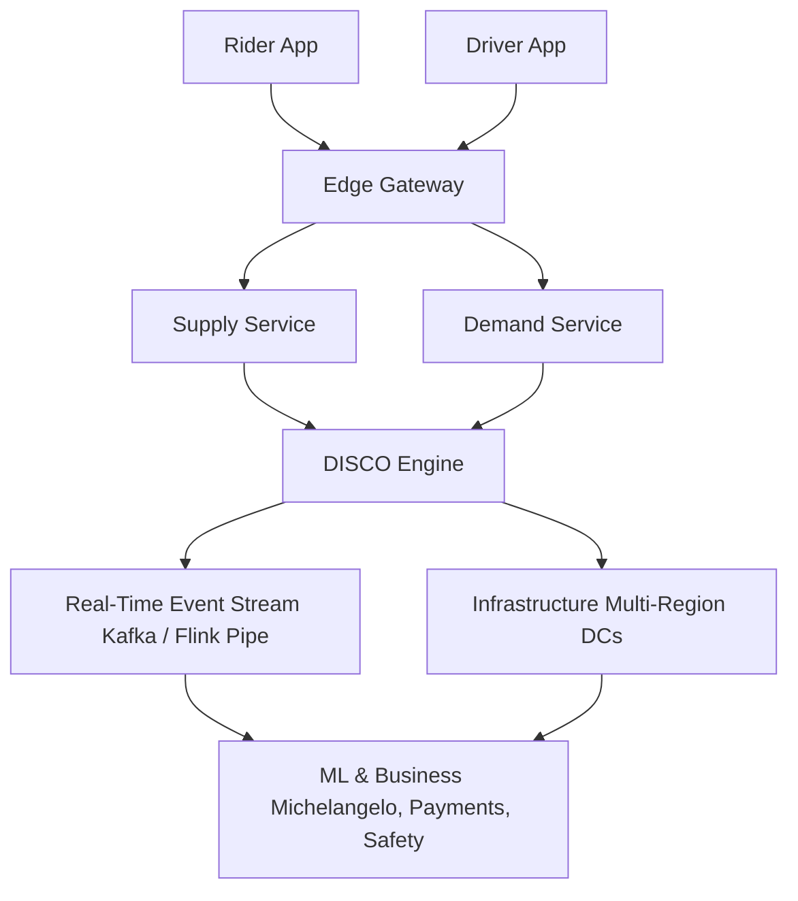
```mermaid
graph TB
    RC["Rider App"]
    DC["Driver App"]
    RC --> EG[Edge Gateway]
    DC --> EG
    EG --> SS[Supply Service]
    EG --> DS[Demand Service]
    SS --> DE[DISCO Engine]
    DS --> DE
    DE --> RTE[Real-Time Event Stream Kafka / Flink Pipe]
    DE --> INF[Infrastructure Multi-Region DCs]
    RTE --> MLB[ML & Business Michelangelo, Payments, Safety]
    INF --> MLB
```

## Geospatial Indexing (Google S2)

The foundation of Uber's location system is Earth partitioning. Because calculating precise distances on a 3D sphere (latitude/longitude) in real-time for millions of users is too computationally expensive, Uber uses Google's S2 geometry library.

**Cell Mapping:** S2 projects the Earth onto a cube and uses a Hilbert space-filling curve to divide it into hierarchical cells (each assigned a unique 64-bit Cell ID). Level 13 cells (~0.5 km²) or Level 14 (~0.1 km²) are typically used for neighborhood-level dispatching.

**Searching:** When a rider opens the app, the backend translates their coordinate into an S2 Cell ID. Instead of searching the whole database, the system simply queries drivers registered inside that specific Cell ID and its 8 immediate neighbors.

## The Core Ride Loop Architecture

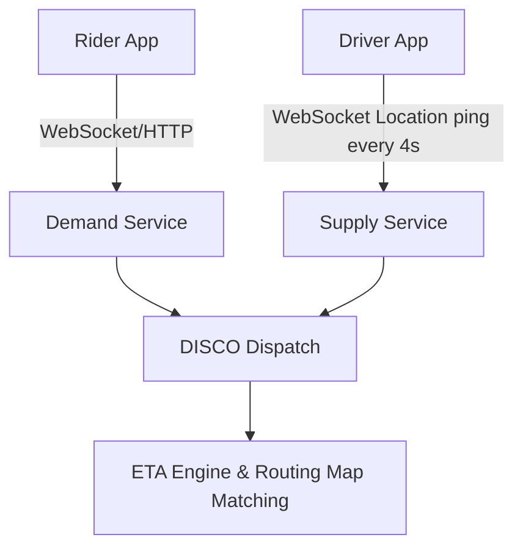
```mermaid
graph TB
    RA[Rider App] -->|WebSocket/HTTP| DS[Demand Service]
    DA[Driver App] -->|WebSocket Location ping every 4s| SS[Supply Service]
    DS --> DISCO[DISCO Dispatch]
    SS --> DISCO
    DISCO --> ETA[ETA Engine & Routing Map Matching]
```

**Step A: Supply Service (Tracking Drivers)**
Every active driver app sends a location ping via WebSockets or HTTP back to the Supply Service roughly every 4 seconds. These pings stream into Apache Kafka (Uber's real-time message hub) and update an in-memory spatial index (like Redis) with the driver's current S2 Cell ID.

**Step B: Demand Service (Rider Request)**
When a rider opens the app, the Demand Service picks up their GPS coordinates, destination, and selected vehicle tier (e.g., UberX, XL).

**Step C: The Matching Engine — DISCO (Dispatch Optimization)**
Uber's core matching engine is called DISCO. DISCO receives a ride request from Demand Service. It queries Supply Service for candidate drivers within the local S2 cell radius. Instead of simple straight-line distance, DISCO passes candidates to the ETA Engine. The ETA Engine uses actual road networks, traffic conditions, and routing algorithms to compute real drive times for each driver. DISCO selects the optimal driver (minimizing overall wait time for the system, not just a single rider) and pushes a notification to that driver's phone.

## Data Architecture & Storage

Uber processes petabytes of data daily and uses specialized storage for different speed requirements:

- **In-Memory Caching (Redis):** Stores transient, high-speed data like current driver locations, session states, and active ride statuses.
- **Transactional Storage (Schemaless / MySQL):** Uber built Schemaless—a fault-tolerant, high-throughput key-value store layered on top of MySQL—to hold trip details, user profiles, and order records.
- **Real-time Analytics (Apache Pinot & Flink):** Powers dynamic pricing (Surge), fraud detection, and driver incentives by processing streaming data in real time.
- **Data Warehouse (Hadoop/HDFS & Parquet):** Stores historical trip data for long-term machine learning model training, ETA predictions, and business analytics.

## Microservice Organization: DOMA

To manage thousands of individual microservices, Uber introduced Domain-Oriented Microservice Architecture (DOMA). It organizes code into 5 distinct layers:

1. **Edge Layer:** The API Gateways exposing public endpoints to mobile apps.
2. **Presentation Layer:** App-specific logic for iOS, Android, or Web interfaces.
3. **Product Layer:** Core business logic specific to a product (e.g., Rides, Eats, Freight).
4. **Business Layer:** Shared capabilities used across all products (e.g., Payments, Passports/Identity, Billing).
5. **Infrastructure Layer:** Low-level operations like database management, networking, and deployment frameworks.

## Core Design Drivers: Ratio, CQRS & CAP Trade-Offs

The `1:10` driver-to-rider ratio and the AP vs. CP split directly dictate how you choose your databases, write protocols, and partition strategy. Here is exactly how those two insights shaped the blueprint.

### How the `1:10` Driver-to-Rider Ratio Shapes the System

The ratio creates an asymmetric Read/Write profile:

$$\text{Writes} = 250,000 \text{ pings/sec (Drivers sending updates)}$$
$$\text{Reads} = 50,000\text{--}100,000 \text{ queries/sec (Riders opening maps, searching, polling)}$$

While there are more riders overall, drivers write far more frequently (every 4 seconds) than riders query. This asymmetry forced three critical architectural choices:

**1. Ingestion Protocol Choice (gRPC over HTTP/2 vs. REST):** Without the 1:10 write-heavy ratio, you might use standard REST HTTP/1.1 POST calls for location pings. With 250,000 writes/sec, establishing 250,000 new TCP/TLS connections every second would crash your API gateways due to handshake overhead. The high write ratio forced us to use long-lived gRPC streaming connections over HTTP/2, allowing 1,000,000 drivers to keep persistent sockets open and stream tiny binary Protobuf payloads with minimal CPU overhead.

**2. CQRS Pattern (Command Query Responsibility Segregation):** Because driver updates happen on a relentless 4-second ticker, you cannot let rider search queries hit the same database table or lock the same rows. We completely separated the Write Path (Driver → Kafka → Redis Primary) from the Read Path (Rider → Redis Read Replicas). Riders reading nearby drivers never block drivers writing their new locations.

### How the AP vs. CP Trade-Off Shapes the System

Instead of choosing one CAP trade-off for the entire platform, we split the system into two distinct sub-domains based on business requirements:

| Engine | Requirement | Trade-off Choice | Storage Engine | Flow |
|--------|-------------|----------------|----------------|------|
| Location Tracking Engine | High Availability & Sub-second Latency | AP Eventual Consistency | Redis Spatial Cluster | → feeds into → |
| Matching & Trip State Engine | Zero Double-Bookings, Financial Integrity | CP Strong Consistency | Distributed RDBMS (CockroachDB / Postgres) | |

**The AP Engine (Location Streaming):** If a driver drops connection for 3 seconds, or if a rider sees a driver's icon 50 meters away from where they actually are, nobody loses money. We chose Redis + Kafka configured for speed over strict ACID guarantees. Writes are non-blocking. If a location ping fails due to a momentary network partition, we simply drop it and wait for the next ping 4 seconds later. No distributed database transactions are used for pings.

**The CP Engine (Match & Dispatch Execution):** If two riders press "Request Ride" at the exact same millisecond for the exact same driver, and both get confirmed, the business loses trust and money. Availability must yield to absolute consistency here. We switched from the AP fast-path (Redis) to a CP transactional execution path with Distributed Locks (Redlock) + Atomic Lua Scripts + Relational DB ACID Transactions (SELECT FOR UPDATE or Optimistic Locking). If a network partition occurs during a match, the system fails the request and asks the rider to try again (sacrificing Availability) rather than risk double-booking the driver (preserving Consistency).

### Summary Matrix

| Metric / Constraint | Design Decision Driven By It |
|---------------------|------------------------------|
| `1:10` Asymmetric Scale | Separated Read/Write pipelines (CQRS) and used persistent gRPC streams instead of REST |
| AP (Location Tracking) | Redis in-memory storage, dropped-packet tolerance, 2-second eventual consistency |
| CP (Trip Matching) | Pessimistic/Optimistic distributed locking, transactional SQL state updates, hard consistency guarantees |

## Production System Design: Driver Tracking & Matching

### Requirements & Scale Expectations

**Functional:**
- Location tracking: Active drivers send GPS updates every 4 seconds.
- Nearby driver lookup: Riders see available drivers on a map in real time.
- Ride request & matching: Select optimal driver based on ETA (not straight-line distance).
- Offer acceptance: Assigned driver has 15 seconds to accept or decline.

**Non-Functional:**
- Low latency: Location ingestion < 50ms; matching decision < 1 second.
- High throughput: Handle 1,000,000+ active drivers streaming location pings continuously.
- Consistency: Strict single-assignment guarantee (no two riders assigned to the same driver simultaneously).
- High availability: 99.99% uptime with zero single points of failure.

### Pipeline Architecture

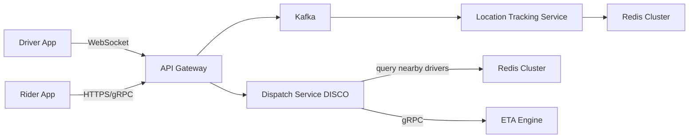
```mermaid
graph LR
    DA[Driver App] -->|WebSocket| AG[API Gateway]
    AG --> K[Kafka]
    K --> LTS[Location Tracking Service]
    LTS --> RC1[Redis Cluster]
    RA[Rider App] -->|HTTPS/gRPC| AG
    AG --> DISCO[Dispatch Service DISCO]
    DISCO -->|query nearby drivers| RC2[Redis Cluster]
    DISCO -->|gRPC| ETA[ETA Engine]
```

**The Write Path (Driver Ingestion):**
1. Driver app streams GPS pings every ~4 seconds over WebSocket.
2. API Gateway terminates TLS and routes pings to Kafka.
3. Kafka buffers the high-volume stream (millions of pings/sec) to shield downstream services from spikes.
4. Location Tracking Service consumes pings, calculates the S2 Cell ID, and updates Redis (driver state + spatial index).

**The Read Path (Rider Match):**
1. Rider sends an HTTPS POST to `/v1/trips/request` via the API Gateway.
2. DISCO handles the request synchronously: it directly queries Redis for nearby driver candidates.
3. DISCO calls the ETA Engine via gRPC with candidate coordinates for real drive times.
4. DISCO selects the optimal driver, acquires a lock, and pushes a notification.

### Protocol Differences: Driver vs. Rider

| Aspect | Driver App | Rider App |
|--------|-----------|-----------|
| Protocol | WebSocket (long-lived, continuous) | HTTPS / gRPC (request-response) |
| Why | Streams location every 4s — needs persistent connection | Requesting a ride is a single action/command |
| Post-match | Stays on WebSocket for dispatch offers | Switches to WebSocket after match (to see driver moving) |

A rider's ride request does NOT go through Kafka. Kafka is an asynchronous event log for writes/streaming, not a synchronous database query engine. DISCO queries Redis directly.

### ETA vs. Real-Time Analytics: Fully Decoupled

Both are separate microservices with different roles:

**A. ETA Engine (Synchronous, inline during match):**
- DISCO queries Redis for candidates (e.g., 10 available drivers in the S2 cell).
- DISCO calls the ETA Service via gRPC with those 10 coordinates + rider pickup.
- ETA returns drive times (Driver A: 3 min, Driver B: 5 min). DISCO picks the best match.

**B. Real-Time Analytics / Surge Pricing (Asynchronous, out-of-band):**
- Analytics does NOT sit inside the request-response loop for matching.
- Flink and Pinot consume raw location and search pings directly from Kafka in the background.
- Stream 1: Driver location updates → calculate available supply per H3 cell.
- Stream 2: Rider app opens/searches → calculate demand per H3 cell.
- Flink computes the surge multiplier (e.g., 1.4x) and writes it to a cache. DISCO reads the pre-computed rate — it never waits for analytics.

| Action | Protocol / Tech | Sync or Async? |
|--------|----------------|----------------|
| Driver Ingestion | WebSocket → API Gateway → Kafka → Redis | Async (event-driven) |
| Rider Search / Match | HTTPS → DISCO → Direct Redis Query | Sync (sub-second RPC) |
| ETA Calculation | DISCO → ETA Engine (gRPC) | Sync (inline during match) |
| Surge / Analytics | Kafka Stream → Flink → Surge Cache | Async (completely out-of-band) |

### Dispatch Flow: Four-Phase Sequence

DISCO does not simply query Redis and the ETA engine and immediately send driver details back to the rider. Instead, it follows a multi-stage workflow:

**Phase 1: Pre-Request & Fare Estimate (Before Requesting)**
When a rider opens the app and enters a destination (before tapping "Confirm"):
- The Ride Service calls the ETA Engine and Pricing Engine.
- The client receives route ETAs and estimated fares (including any dynamic surge multipliers) to display on the UI.
- No driver is assigned or contacted yet.

**Phase 2: Candidate Ranking (DISCO Matching Loop)**
Once the rider taps "Confirm Ride":
1. Fetch Candidates: DISCO receives the pickup lat/lng, identifies the S2/H3 Cell ID, and queries Redis for available drivers in that cell and surrounding cells (k-ring).
2. Batch Routing & Ranking: DISCO passes 10-20 candidate drivers to the ETA Engine, which computes actual road distance and drive time considering turn restrictions and live traffic, ranking drivers by lowest ETA.
3. Multi-Objective Scoring: DISCO evaluates candidates based on minimum ETA, driver rating, acceptance probability, and vehicle type.

**Phase 3: The Lock & Dispatch Offer (Critical Step)**
At this stage, the rider still does not know who their driver is — the selected driver has not yet accepted the job.
1. Acquire Atomic Lock: DISCO attempts an atomic lock in Redis (`SETNX lock:driver_123 ride_999 EX 15`) to reserve the top-ranked driver for 15 seconds.
2. Push Offer to Driver: If the lock succeeds, the Notification/Push Service sends a dispatch offer directly to the Driver App via WebSocket/Push Notification.
3. Driver Decision Window:
   - If Driver Accepts: The lock transitions into an active trip record in the primary database.
   - If Driver Declines or Times Out (15s): The Redis lock expires, and DISCO automatically moves to Candidate #2 on the ranked list.

**Phase 4: Match Confirmation & Push to Rider**
Only after a driver explicitly accepts:
- The system updates the ride state to MATCHED.
- The Notification Service pushes the matched driver's details (name, photo, license plate, vehicle model, current GPS position, and real-time ETA) to the Rider App via WebSocket.
- The Rider App transitions from the "Finding your ride..." screen to the live vehicle map tracking view.

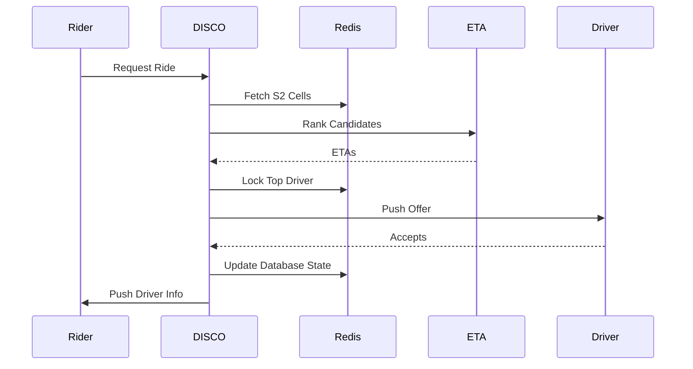
```mermaid
sequenceDiagram
    participant Rider
    participant DISCO
    participant Redis
    participant ETA
    participant Driver

    Rider->>DISCO: Request Ride
    DISCO->>Redis: Fetch S2 Cells
    DISCO->>ETA: Rank Candidates
    ETA-->>DISCO: ETAs
    DISCO->>Redis: Lock Top Driver
    DISCO->>Driver: Push Offer
    Driver-->>DISCO: Accepts
    DISCO->>Redis: Update Database State
    DISCO->>Rider: Push Driver Info
```

### Data Model

**Location Update Payload:**
```json
{
  "driver_id": "drv_98765",
  "lat": 37.774929,
  "lng": -122.419416,
  "bearing": 180.5,
  "status": "AVAILABLE",
  "timestamp": 1770556443
}
```

**Redis Structures:**
- **Driver State (Hash):** `driver:state:{driver_id}` → `{ status, lat, lng, s2_cell_id, last_ping }`
- **Spatial Index (Sorted Set):** `s2:cell:{s2_cell_id}` → `{driver_id}` (only AVAILABLE drivers)

### Concurrency & Lock Management

To guarantee that two riders never match with the same driver at the same time (a race condition), DISCO relies on atomic state transitions and distributed locks in Redis.

#### The Core Problem: Race Conditions

Two riders request a ride at the exact same millisecond in the same neighborhood. Without strict concurrency control, two DISCO instances both pick Driver X, send offers simultaneously, and corrupt trip states.

#### Basic Redis Atomic Lock (SETNX)

DISCO uses Redis's atomic `SETNX` (Set if Not Exists) with a time-to-live:

```
SET driver:lock:drv_98765 "trip_id:ride_111" NX EX 15
```

- `NX`: Only set if the key does not already exist (atomic check-and-set).
- `EX 15`: Auto-expire after 15 seconds (safety net).

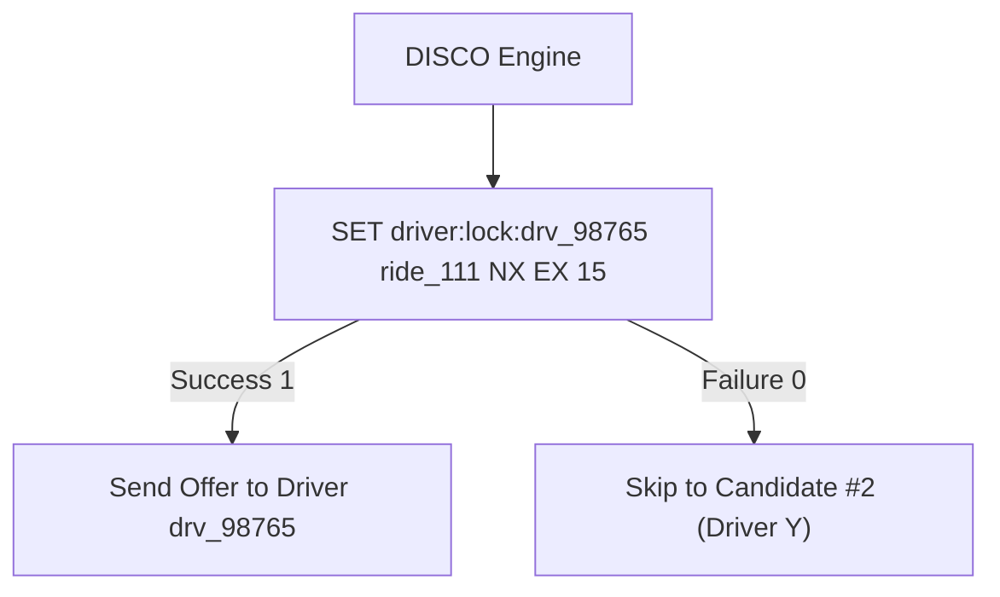
```mermaid
flowchart TD
    DISCO[DISCO Engine]
    SETNX["SET driver:lock:drv_98765 ride_111 NX EX 15"]
    SEND["Send Offer to Driver drv_98765"]
    SKIP["Skip to Candidate #2 (Driver Y)"]

    DISCO --> SETNX
    SETNX -->|Success 1| SEND
    SETNX -->|Failure 0| SKIP
```

#### Edge Cases & State Machines

**Case A — Driver Accepts:**
Driver taps Accept within 15 seconds. DISCO updates driver status in Redis:
```
HSET driver:state:drv_98765 "status" "EN_ROUTE_TO_PICKUP"
```
The lock key is deleted or naturally expires. The driver is no longer in the AVAILABLE spatial index.

**Case B — Driver Declines or Times Out:**
- If Declined: DISCO immediately deletes the lock key with `DEL driver:lock:drv_98765`.
- If Timed Out: Redis automatically expires the key after 15 seconds. DISCO's background timer fetches Candidate #2 and acquires a lock on that driver.

**Case C — Lock Deletion Safety (Lua Script):**
If Thread A's lock expired (15s TTL) and Thread B now holds the lock, a raw `DEL` by Thread A would delete Thread B's valid lock. DISCO uses an atomic Lua script to prevent this:

```lua
if redis.call("get", KEYS[1]) == ARGV[1] then
    return redis.call("del", KEYS[1])
else
    return 0
end
```

#### Enterprise-Grade Locking: Redlock & Distributed State

In a single Redis node, SETNX works perfectly. But Uber runs multi-region Redis Clusters. If the Redis primary receives the lock but crashes before replicating it, the lock is lost.

**Redlock (Multi-Node Consensus):**
DISCO writes to 5 independent Redis master nodes. A lock is only granted if at least 3 out of 5 nodes confirm the SETNX within a strict timeout (~5ms).

**State Machine Double-Check (Database Safeguard):**
Before writing a final trip record to the persistent database (Schemaless), DISCO executes a conditional update:

```sql
UPDATE drivers
SET status = 'ON_TRIP', current_trip_id = 'ride_111'
WHERE driver_id = 'drv_98765' AND status = 'AVAILABLE';
```

If `affected_rows == 0`, another thread updated the driver first, and the transaction safely aborts.

| Scenario | Solution |
|----------|---------|
| Simultaneous match requests | Atomic SETNX lock prevents double-assignment |
| Driver unresponsive (15s) | Redis TTL auto-releases lock for next driver |
| Delayed execution | Lua script validates trip_id before releasing lock |
| Redis master failover | Redlock multi-node consensus or DB conditional update |

### Redis Infrastructure & Network Topology

#### App Instances vs. Redis Instances

App instances (Node.js, Go, Java microservices like DISCO) are stateless and scale based on CPU/memory. Redis instances run the `redis-server` process and hold state (driver locations, session locks). Putting them on separate machines ensures that if an App Service crashes from a code bug, cached data in Redis remains intact.

#### Redis Cluster Node Topology

In a production Redis Cluster, each node (Master or Replica) runs as its own process on a dedicated VM. Running 3 masters on the same VM would defeat the purpose of clustering — one hardware failure takes everything down.

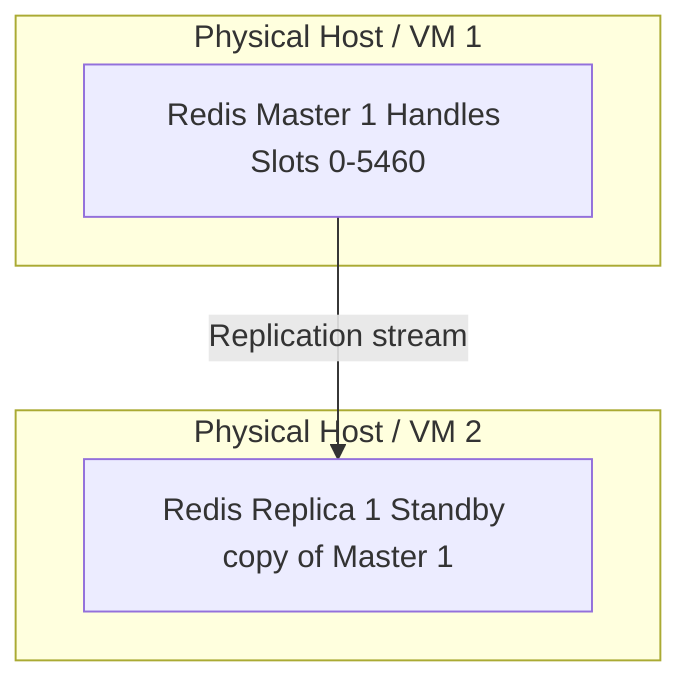
```mermaid
graph TB
    subgraph VM1["Physical Host / VM 1"]
        M1["Redis Master 1 Handles Slots 0-5460"]
    end
    M1 -->|Replication stream| R1
    subgraph VM2["Physical Host / VM 2"]
        R1["Redis Replica 1 Standby copy of Master 1"]
    end
```

#### Communication Protocols

**App to Redis (RESP):** The App communicates with Redis over TCP sockets using RESP (REdis Serialization Protocol). The App maintains a connection pool (pre-opened persistent TCP sockets) to all Redis nodes. It hashes the key, determines which Redis Master holds that data slot, and sends the command directly to that specific VM.

**Between Redis Nodes (Gossip Protocol):** Redis Cluster nodes talk to each other on a separate Cluster Bus port (standard port + 10000, e.g., 16379). They use a Gossip Protocol to ping each other every second, exchange cluster state, and detect if a Master has crashed. If Master 1 stops responding, Replicas vote via consensus and automatically promote Replica 1 to become the new Master.

#### Why Redis is Still Fast on a Different Machine

| Operation | Typical Time |
|-----------|-------------|
| Disk I/O (Database Read) | 5 ms – 20 ms |
| Redis Remote RAM Read + Network Latency | 0.5 ms – 1.5 ms |
| CPU Memory Read (Internal) | 100 nanoseconds |

Four factors keep it fast:
- **Sub-millisecond DC latency:** LAN between VMs is 0.2ms–0.8ms.
- **In-memory speed:** Redis reads from RAM (nanoseconds) vs. disk (milliseconds).
- **TCP connection pooling:** Reuses existing sockets, avoiding 3-way handshake per request.
- **Pipelining:** Bundles multiple commands into a single TCP packet.

#### What If All Redis Masters and Replicas in a Region Go Down?

**Scenario A: Cross-Region Failover (Active-Active)**
- API Gateway detects Region A is dead and shifts all traffic to Region B.
- Region B runs its own independent Redis Cluster and App Instances.
- Dynamic location data from the past few seconds in Region A might be lost, but driver apps reconnect to Region B and send a fresh location ping within 4 seconds, repopulating Redis instantly.

**Scenario B: Circuit Breaker Fallback**
- If cross-region routing isn't available, or both region caches crash, the App stops sending requests to Redis (avoids hanging on timeouts).
- The App falls back to querying the persistent database (Cassandra, DynamoDB, or Schemaless) directly.
- Performance degrades (higher latency), but the core feature stays functional rather than throwing a hard error.

### Scaling & Resiliency

| Bottleneck | Mitigation |
|-----------|-----------|
| Hotspot S2 cells (airport, stadium) | Shard Redis sets by `s2_cell_id + hash_slot`; use local memory caching for ultra-popular zones |
| Gateway socket exhaustion | Use Netty/epoll non-blocking I/O to hold 100k+ open WebSocket connections per instance |
| Driver connection drop | Background worker marks driver OFFLINE and removes from S2 index if no ping in > 12 seconds |

## Supporting Architecture Layers

### Data Mesh & Machine Learning Platform (Michelangelo)

Matching drivers and riders isn't purely rule-based — it relies on AI/ML predictions running in real time:

- **Michelangelo:** Uber's proprietary ML platform serving thousands of production models. It handles real-time feature stores, model training, and low-latency inference.
- **Dynamic Pricing (Surge):** Flink processes real-time event streams from Kafka (rider app opens vs. available drivers per H3 grid cell). Michelangelo uses this to update pricing multipliers dynamically to balance market demand.
- **DeepETA:** Neural networks continuously update estimated trip times by evaluating weather, historical traffic, and micro-routing nuances.

### High Availability & Multi-Region Resiliency

Uber cannot afford downtime in any city.

- **Active-Active Datacenters:** Uber runs multi-region deployments. If an entire cloud region or datacenter fails, traffic automatically fails over without losing active trip states.
- **Stateful Failover:** In-flight trip states are replicated cross-region so a driver mid-trip won't lose navigation or fare tracking if a server cluster dies.

### Payment Processing & Financial Settlement

Handling money across hundreds of currencies, payment methods, and tax jurisdictions is an architectural domain of its own:

- **Double-Entry Ledger:** Ensures financial consistency — a dollar charged to a rider must strictly balance across Uber's fee, driver payout, and local tax.
- **Payout Pipelines:** Real-time risk screening before pushing money to driver bank accounts or debit cards globally.

### Safety & Telematics Processing

Driver phones stream gyroscope, accelerometer, and GPS sensor data back to Uber:

- Real-time anomaly detection flags sudden stops, crashes, or erratic driving.
- Safety features like crash detection trigger immediate customer support outreach via automated workflows.

### Open-Source Ecosystem Originated by Uber

To support this architecture, Uber custom-built several industry-standard tools:

- **H3:** A hexagonal spatial index (used alongside Google's S2) that makes neighborhood grid boundaries and aggregation visually smooth.
- **Jaeger:** A distributed tracing tool built to trace a single request as it passes through hundreds of DOMA microservices.
- **Cadence / Temporal:** Workflow orchestration engines designed to handle complex, long-running transactions (e.g., ride cancellations, refund processing, multi-step onboarding) cleanly without losing state.

| Challenge | Architectural Solution |
|-----------|----------------------|
| Geospatial Queries | Google S2 cells for spatial indexing and rapid lookups |
| High Write Ingestion | Apache Kafka for streaming millions of driver GPS pings/sec |
| Matching Speed | In-memory DISCO matching engine coupled with a custom ETA engine |
| High Availability | Active-active multi-datacenter deployment (if one region fails, another takes over instantly) |

## Historical Data Storage & Database Scaling

Storing billions of historical trip records is a fundamentally different problem than tracking live drivers in Redis. Live tracking requires ultra-low latency and ephemeral in-memory state, whereas historical data requires infinite scalability, high write throughput, multi-region persistence, and zero data loss.

Uber moved away from monolithic relational databases and built **Schemaless** — an in-house distributed, fault-tolerant datastore layered on top of MySQL, complemented by a Hadoop/Data Lake tier for long-term analytical storage.

### Schemaless: The Core Storage Engine

When a trip completes, it transitions from short-lived memory state into a permanent record. Standard relational databases hit a wall when table sizes exceed billions of rows — index maintenance, schema migrations, and cross-node joins degrade performance.

Schemaless is an append-only, key-value datastore built over clusters of MySQL instances:

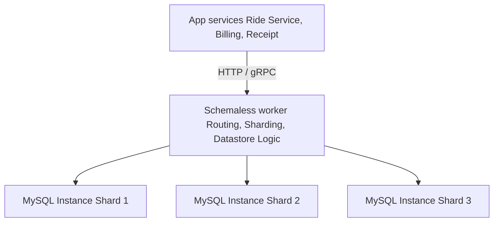
```mermaid
graph TB
    APP["App services Ride Service, Billing, Receipt"]
    APP -->|HTTP / gRPC| SW["Schemaless worker Routing, Sharding, Datastore Logic"]
    SW --> M1["MySQL Instance Shard 1"]
    SW --> M2["MySQL Instance Shard 2"]
    SW --> M3["MySQL Instance Shard 3"]
```

**Key Design Principles:**

- **Append-Only Immutable Rows (No UPDATE):** Trip details are never updated in-place. If a fare is adjusted, Schemaless writes a new version appended to the existing record. This eliminates table lock contention and makes writes fast and predictable.
- **No Database-Level Indexing or Joins:** MySQL instances are used purely as dumb storage engines. All indexing and relational logic is handled at the application layer.
- **Cell Entities:** Data is stored as JSON blobs called "cells" identified by three parameters:
  - **Row Key:** The `trip_uuid`.
  - **Column Name:** The domain data (e.g., `driver_info`, `fare_breakdown`).
  - **Ref Key:** An incremental version integer ordering updates chronologically.

### Horizontal Scaling Strategies

**A. Dynamic Sharding by trip_uuid:**
Schemaless groups virtual shards across physical MySQL instances. A write request hashes the `trip_uuid` using consistent hashing to map to a specific Shard ID. If a database server approaches capacity, virtual shards migrate to new physical nodes in the background without downtime.

**B. Functional Sharding (Domain Isolation):**
Trip data is separated logically by domain so high-volume operations don't impact mission-critical billing:
- **Trip Datastore:** Core trip metadata (coordinates, timestamps, state history).
- **Payment Datastore:** Isolated cluster for strict ACID compliance and financial audit trails.
- **Driver Partner Datastore:** Earnings, payouts, and tax documentation.

### Tiered Storage: Hot, Warm, and Cold

Keeping decades of trip history in expensive high-speed transactional databases is not viable. Uber moves data through a tiered lifecycle:

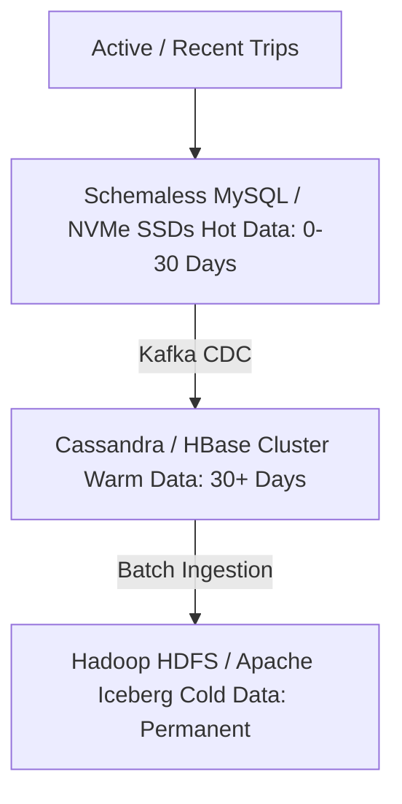
```mermaid
graph TB
    ACTIVE["Active / Recent Trips"] --> HOT["Schemaless MySQL / NVMe SSDs Hot Data: 0-30 Days"]
    HOT -->|Kafka CDC| WARM["Cassandra / HBase Cluster Warm Data: 30+ Days"]
    WARM -->|Batch Ingestion| COLD["Hadoop HDFS / Apache Iceberg Cold Data: Permanent"]
```

- **Hot Tier (Schemaless / NVMe SSDs):** Active and recent trips (0-30 days). Optimized for fast API reads (e.g., viewing a recent receipt).
- **Warm Tier (Cassandra / HBase):** Older trips where high-throughput reads are infrequent, but individual point lookups (e.g., auditing a trip from 2 years ago) must still complete under 100ms.
- **Cold Tier / Data Lake (Hadoop HDFS, Parquet, Apache Iceberg):** Changes in Schemaless are published to Kafka via Change Data Capture (CDC). Stream ingestion pipelines write these into columnar Parquet files in a Hadoop Data Lake. Data teams query this tier using Presto/Trino or Spark for long-term trends, ETA model retraining, and fraud pattern recognition.

### Multi-Region Data Replication

Uber operates in an Active-Active configuration across regions:

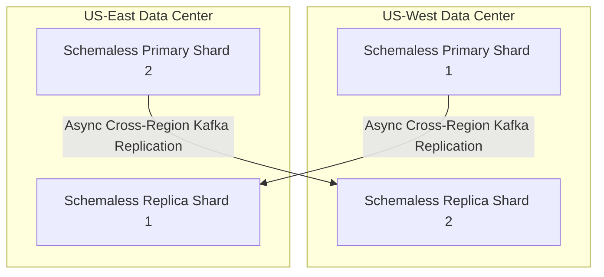
```mermaid
graph TB
    subgraph WEST["US-West Data Center"]
        P1["Schemaless Primary Shard 1"]
        R2["Schemaless Replica Shard 2"]
    end
    subgraph EAST["US-East Data Center"]
        P2["Schemaless Primary Shard 2"]
        R1["Schemaless Replica Shard 1"]
    end
    P1 -->|Async Cross-Region Kafka Replication| R1
    P2 -->|Async Cross-Region Kafka Replication| R2
```

- **Asynchronous Multi-Master Replication:** Each region acts as primary master for its local shards while asynchronously replicating writes to other regions via Kafka event pipelines.
- **Conflict Resolution:** Because Schemaless uses append-only rows with incremental Ref Keys, concurrent writes across two regions do not overwrite each other — they append new versions resolved at read time using deterministic timestamp rules.

| Need | Solution |
|------|---------|
| High Write Throughput | Schemaless: Append-only architecture over MySQL nodes |
| Horizontal Scalability | Consistent hashing by trip_uuid across virtual shards |
| Cost-Effective Retention | Data Tiering: Hot (Schemaless) → Warm (Cassandra) → Cold (Hadoop/Iceberg) |
| Analytical Querying | Kafka CDC pipelines streaming into a Parquet-based Data Lake |

### Change Data Capture (CDC): Operational to Analytical Bridge

Change Data Capture is the real-time bridge connecting Uber's operational databases (Schemaless / MySQL) with its downstream analytical systems (Kafka, Apache Hadoop, Apache Pinot, and the Data Lake). Instead of running heavy SQL queries (`SELECT * FROM trips WHERE updated_at > ...`) against the operational database — which degrades performance for live drivers and riders — CDC streams data mutations asynchronously and directly out of the database write log (binlog) with zero impact on database performance.

#### The CDC Pipeline Architecture

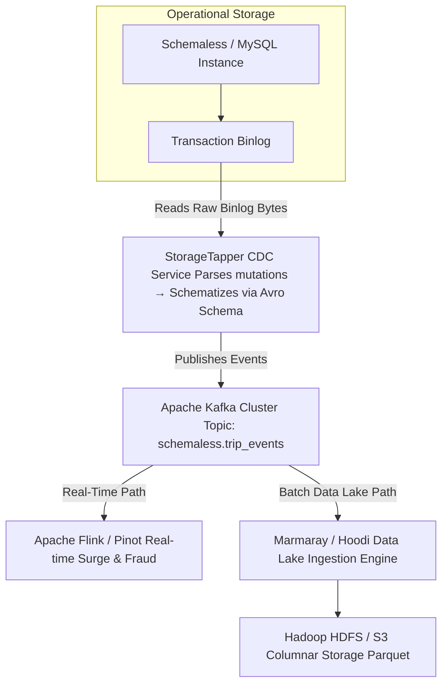
```mermaid
graph TB
    subgraph STORAGE["Operational Storage"]
        MYSQL["Schemaless / MySQL Instance"]
        BINLOG["Transaction Binlog"]
        MYSQL --> BINLOG
    end
    BINLOG -->|Reads Raw Binlog Bytes| ST["StorageTapper CDC Service Parses mutations → Schematizes via Avro Schema"]
    ST -->|Publishes Events| KAFKA["Apache Kafka Cluster Topic: schemaless.trip_events"]
    KAFKA -->|Real-Time Path| FLINK["Apache Flink / Pinot Real-time Surge & Fraud"]
    KAFKA -->|Batch Data Lake Path| MH["Marmaray / Hoodi Data Lake Ingestion Engine"]
    MH --> HDFS["Hadoop HDFS / S3 Columnar Storage Parquet"]
```

#### Step-by-Step Data Journey

**Step A: Capturing Binlog Events (StorageTapper)**

When a driver completes a trip, Schemaless writes a row update to MySQL. MySQL writes this mutation to its Binary Log (binlog) — a low-level execution log of raw binary changes (INSERT, UPDATE, DELETE). Uber built an internal CDC engine called StorageTapper (now part of the DBEvents framework). StorageTapper acts as a "dummy secondary replica" to the MySQL database. It reads the raw binlog bytes directly from disk without locking database tables or executing CPU-heavy SQL queries.

**Step B: Schema Enforcement & Serialization (Apache Avro)**

Raw binlog data is unorganized binary bytes. To make it usable across the company:

- StorageTapper looks up the Schema-Service to map raw table columns into a standardized Apache Avro format.
- It converts the database row mutation into a structured event JSON/Avro payload containing:
  - **Operation Type:** INSERT, UPDATE, DELETE
  - **Metadata:** Database name, table name, commit timestamp, log position offset
  - **Payload:** before_image (old row values) and after_image (new row values)

**Step C: Streaming to Apache Kafka**

StorageTapper publishes these schematized change events into Apache Kafka topics (e.g., `schemaless.trip_events`). Using Kafka as the CDC message buffer offers major architectural advantages:

- **Decoupling:** Upstream database engineers don't need to know who is consuming the data.
- **Replayability:** If a downstream data-processing pipeline crashes, it can rewind its Kafka consumer offset and reprocess CDC events without touching the primary database.
- **Fan-out:** A single database UPDATE event published to Kafka can simultaneously feed real-time analytics (Flink), security audit logs, and the cold storage data lake (Hadoop).

#### Ingesting CDC Streams into the Data Lake (Hadoop/Hudi)

Streaming raw CDC updates into Apache Hadoop (HDFS) presents a major challenge: HDFS is designed for immutable, large-file batch processing, whereas CDC streams consist of millions of small, chaotic, out-of-order updates. To solve this, Uber created Apache Hudi (Hadoop Upserts Deletes and Incrementals), now a top-level Apache open-source project.

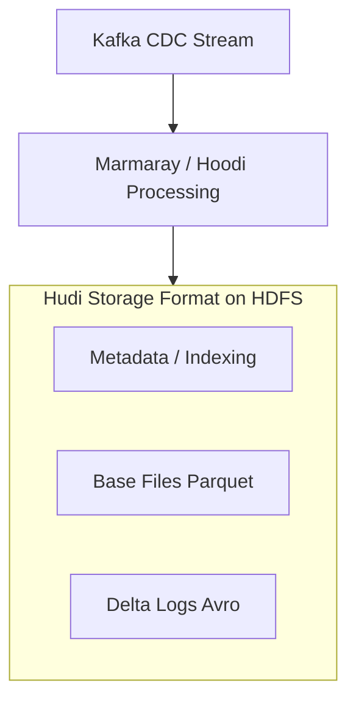
```mermaid
graph TB
    KAFKA["Kafka CDC Stream"] --> MH["Marmaray / Hoodi Processing"]
    MH --> HUDI
    subgraph HUDI["Hudi Storage Format on HDFS"]
        META["Metadata / Indexing"]
        BASE["Base Files Parquet"]
        DELTA["Delta Logs Avro"]
    end
```

**How Hudi Handles CDC Incremental Writes:**

- **Upserts via Record Key Indexing:** Hudi maintains a record key index (e.g., indexed by trip_uuid). When a CDC record arrives in Kafka for an existing trip, Hudi knows exactly which Parquet data file on HDFS contains that trip.
- **Copy-on-Write (COW) vs. Merge-on-Read (MOR):**
  - **Merge-on-Read (MOR):** Incoming CDC updates are appended to fast, lightweight Delta Logs (Avro format).
  - **Compaction:** A background compaction job periodically merges the Delta Logs with the historical base files (Parquet format), creating a fresh, highly compressed columnar snapshot for analytical queries.

#### Key Engineering Challenges & Solutions

| CDC Challenge | How Uber Solved It |
|---------------|--------------------|
| Schema Evolution | Upstream table schemas change over time (e.g., adding new columns). Uber uses an Avro Schema Registry. If a breaking schema change occurs, StorageTapper flags it and prevents invalid data from corrupting the Data Lake. |
| Data Ordering & Deduplication | Distributed Kafka topics can sometimes deliver events out-of-order or duplicate them. Every CDC event contains the source database transaction timestamp and sequence ID. Hudi uses these fields to apply changes in exact chronological order. |
| Cross-Region Replication | Uber built uReplicator (an optimized alternative to Kafka MirrorMaker) to mirror CDC Kafka topics between geographically distant datacenters without losing offsets or introducing lag. |

#### Summary Checklist: The Complete Loop

1. Schemaless / MySQL accepts trip write → Appends to MySQL binlog.
2. StorageTapper tail-reads binlog → Converts bytes to Avro CDC events.
3. Events land in Apache Kafka within seconds.
4. Apache Hudi / Marmaray consumes Kafka CDC messages → Performs incremental upserts into Parquet files on Hadoop HDFS.
5. Data Engineers / ML Models query the updated Parquet data using Presto, Hive, or Spark.

## Durable Execution & Financial Ledger

To handle complex multi-step processes and maintain financial accuracy, Uber relies on two fundamental architectural patterns: Durable Execution (Cadence/Temporal) and SOX-Compliant Double-Entry Accounting (Gulfstream).

### Distributed Workflows: Cadence / Temporal

When a trip is canceled mid-route, several microservices must execute steps in a precise sequence: charge a cancellation fee, notify the driver, update driver availability, issue promo credits, and recalibrate matching algorithms. Standard microservices using HTTP calls or message queues risk losing state if the payment service drops connection halfway through, leading to duplicate charges or orphaned transactions.

Uber created Cadence (now evolved in the open-source community as Temporal) to solve this via Durable Execution.

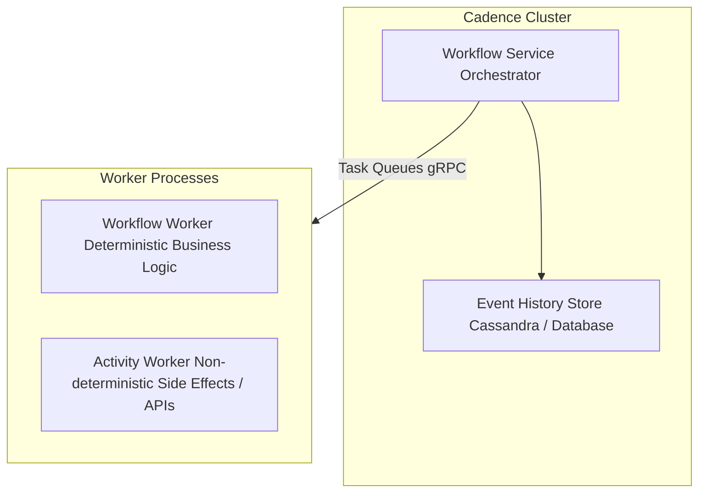
```mermaid
graph TB
    subgraph CADENCE["Cadence Cluster"]
        WS["Workflow Service Orchestrator"]
        EHS["Event History Store Cassandra / Database"]
        WS --> EHS
    end
    WS -->|Task Queues gRPC| WORKERS
    subgraph WORKERS["Worker Processes"]
        WW["Workflow Worker Deterministic Business Logic"]
        AW["Activity Worker Non-deterministic Side Effects / APIs"]
    end
```

**Workflows vs. Activities:**

To achieve crash resilience, Cadence strictly splits code into two concepts:

- **Workflows (State Logic):** Written as standard, imperative code (Go, Java, Python). They must be completely deterministic — they cannot make API calls, access the system clock, or generate random numbers directly. They simply dictate order: "Execute Step A, wait for signal X, then execute Step B."
- **Activities (Side Effects):** Non-deterministic actions live here: charging a credit card, sending an SMS, or calling a third-party API. Activities can fail, time out, and be retried independently using automatic backoff policies defined by the workflow.

**Replay-Based Recovery (Durable Execution):**

Cadence does not take memory snapshots of your code. Instead, it uses Event Sourcing:

```
Event History Stream:
[1] WorkflowStarted --> [2] ActivityScheduled(ChargeFee) --> [3] ActivityCompleted(Success)
```

Every time an Activity completes, Cadence commits an event to an immutable Event History database (Cassandra or MySQL). If the worker host running your workflow dies mid-execution, Cadence spins up a brand new worker node. The new worker re-executes the Workflow code from line 1. When it hits `ChargeFee()`, Cadence checks the Event History, sees `ActivityCompleted(Success)`, skips calling the payment API again, and immediately feeds the stored result directly into the code variable. The workflow resumes at line N without performing duplicate operations.

**Saga Pattern & Compensation Logic:**

In distributed transactions without 2-Phase Commit (2PC), Cadence implements the Saga Pattern for rollback recovery. If an operation fails late in the flow, compensation steps run in reverse:

```go
func CancellationWorkflow(ctx workflow.Context, tripID string) error {
    var saga CompensationSaga

    err := workflow.ExecuteActivity(ctx, ReserveDriverPayout, tripID).Get(ctx, nil)
    if err != nil { return err }
    saga.AddCompensation(ReleaseDriverPayout, tripID)

    err = workflow.ExecuteActivity(ctx, ChargeRiderFee, tripID).Get(ctx, nil)
    if err != nil {
        saga.Compensate(ctx)
        return err
    }
    return nil
}
```

### Financial Ledger & Double-Entry Bookkeeping (Gulfstream)

Handling money across millions of trips requires strict financial auditability (SOX compliance). A single database field like `user_balance = user_balance - $10` is forbidden because it lacks an audit trail and causes catastrophic race conditions. Uber's core financial platform, Gulfstream, enforces Double-Entry Bookkeeping.

**The Fundamental Rule:** Money Is Neither Created Nor Destroyed

In Gulfstream, every monetary movement is represented as an immutable transaction where:

$$\sum \text{Debits} = \sum \text{Credits}$$

Every balance is simply the sum total of its history of ledger entries.

**Example: $20 Fare with a $5 Promo Code**

When a rider takes a $20 ride using a $5 promo code, Uber's platform fee is $3, and the driver earns $17. Gulfstream writes a single balanced atomic transaction containing 4 entries:

| Account | Entry Type | Amount |
|---------|-----------|--------|
| Rider:Account | Debit (Asset reduction/Payment) | $15.00 |
| Uber:MarketingPromo | Debit (Expense/Subsidy) | $5.00 |
| Driver:Account | Credit (Liability/Owed to driver) | $17.00 |
| Uber:Revenue | Credit (Revenue retained) | $3.00 |

$$\text{Total Debits } (\$15 + \$5 = \$20) \equiv \text{Total Credits } (\$17 + \$3 = \$20)$$

**High-Throughput Account Scaling (Batching & Concurrency):**

A major engineering challenge with double-entry ledgers is hotspot write contention. When thousands of riders finish trips at 5:00 PM, Uber's central accounts (like Uber:Revenue or global driver payout pools) experience tens of thousands of concurrent writes per second. Standard database row-locking causes massive bottlenecking.

Uber solved this by building a 250ms User Account Batch Processing Engine:

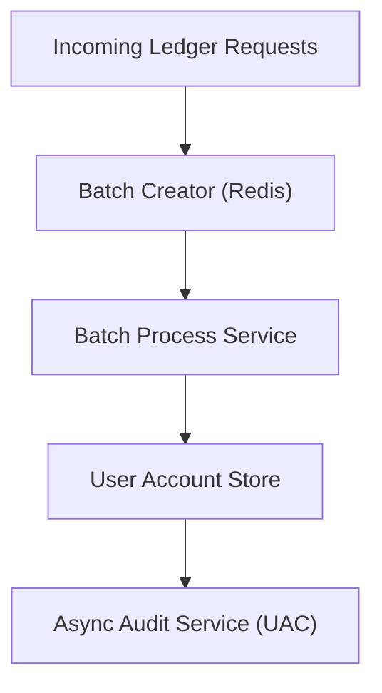
```mermaid
graph TB
    REQ["Incoming Ledger Requests"] --> BC["Batch Creator (Redis)"]
    BC --> BPS["Batch Process Service"]
    BPS --> UAS["User Account Store"]
    UAS --> AAS["Async Audit Service (UAC)"]
```

- **Sub-Second Aggregation:** Operations targeting the same account are grouped into 250-millisecond windows using Redis coordination.
- **Single Read/Write Cycle:** Instead of 50 independent SQL reads/writes for 50 updates, the engine reads the current account state once, applies all 50 debit/credit mutations in memory, and writes back the updated balance in a single atomic batch update.
- **Optimistic Locking:** The batch update validates account versions (`WHERE version = 104`). If a conflict occurs, the batch quickly retries without holding long database locks.
- **Asynchronous Audit Logging:** Writing the User Account Changelog (UAC) audit trail is decoupled from the critical path using Kafka, reducing database round-trip times to 8–20ms per operation.

### Architectural Comparison

| Need | Distributed Workflow (Cadence) | Financial Ledger (Gulfstream) |
|------|-------------------------------|------------------------------|
| Primary Goal | Orchestrate long-running, multi-step business logic without dropping state | Guarantee mathematical correctness and auditability of funds |
| Failure Recovery | Replay-based recovery from event history logs; Saga compensation rollbacks | Atomic batch updates; double-entry balance constraints ($\sum \text{Debits} = \sum \text{Credits}$) |
| Consistency Model | Eventual consistency across microservices via orchestrator tasks | Strict serializability and ACID compliance at the account entry level |
| Throughput Strategy | Decoupled background task queues and priority-based scheduling | 250ms time-window batching with optimistic locking in Redis |

### Workflow Design Hierarchy: Steps, Flows, and Journeys

Determining how to decompose a system into Steps (Activities), Flows (Child/Parent Workflows), and Journeys (Entities) is the most critical design decision in durable execution. If boundaries are too granular, you hit Event History limits (default 51,200 events per execution). If they are too broad, your code becomes monolithic and hard to recover or test.

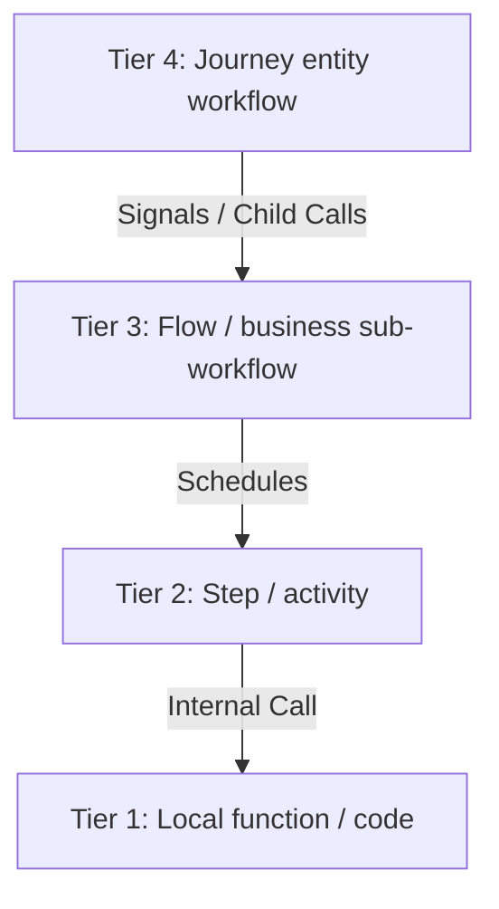
```mermaid
graph TB
    T4["Tier 4: Journey entity workflow"]
    T3["Tier 3: Flow / business sub-workflow"]
    T2["Tier 2: Step / activity"]
    T1["Tier 1: Local function / code"]
    T4 -->|Signals / Child Calls| T3
    T3 -->|Schedules| T2
    T2 -->|Internal Call| T1
```

**Tier 2 — Step (Activity):** A unit of work that interacts with the real world or performs non-deterministic logic. Make it an Activity if it involves network I/O, non-deterministic operations (time.Now(), random UUID), requires failure retries with exponential backoff, or heavy CPU computation. Keep it inline in the Workflow if it's pure data manipulation (validating input, mapping JSON, basic math).

**Tier 3 — Flow (Child / Sub-Workflow):** A self-contained, bounded business sequence. Make it a Sub-Workflow if it is a reusable business unit (e.g., Refund & Cancellation Flow invoked by multiple parents), generates thousands of events (so its history completes independently), needs an independent failure domain, or is owned by a different team.

**Tier 4 — Journey (Entity / Long-Running Workflow):** Models the long-term state machine of a core business entity (e.g., a Driver, a Vehicle). Make it an Entity Journey if it spans months or years, coordinates state via incoming Signals (`for { select { ... } }`), and uses `ContinueAsNew` to atomically truncate event history before hitting the 50,000 event limit.

**Decision Matrix:**

| Question | Step (Activity)? | Flow (Sub-Workflow)? | Journey (Entity)? |
|----------|:---:|:---:|:---:|
| Calls an external API or DB? | YES | No | No |
| Should be retried independently? | YES | No | No |
| Represents an entire business task? | No | YES | No |
| Will generate thousands of events? | No | YES (isolates history) | YES (uses ContinueAsNew) |
| Listens for signals over months? | No | No | YES |

**Real-World Example: Driver Onboarding**

```go
// TIER 4: JOURNEY (Entity Workflow - Driver Lifetime)
func DriverJourneyWorkflow(ctx workflow.Context, driverID string) error {
    state := InitialDriverState()

    for {
        var signal DriverSignal
        workflow.GetSignalChannel(ctx, "driver-events").Receive(ctx, &signal)

        switch signal.Type {
        case "SUBMIT_DOCUMENTS":
            // TIER 3: FLOW (Child Workflow)
            err := workflow.ExecuteChildWorkflow(ctx, DocumentVerificationFlow, driverID).Get(ctx, nil)
            if err == nil { state.IsVerified = true }

        case "RETIRE_DRIVER":
            return nil
        }

        if workflow.GetInfo(ctx).HistoryLength > 20000 {
            return workflow.NewContinueAsNewError(ctx, DriverJourneyWorkflow, driverID, state)
        }
    }
}

// TIER 3: FLOW (Sub-Workflow)
func DocumentVerificationFlow(ctx workflow.Context, driverID string) error {
    err := workflow.ExecuteActivity(ctx, CallBackgroundCheckAPI, driverID).Get(ctx, nil)
    if err != nil {
        _ = workflow.ExecuteActivity(ctx, SendRejectionEmail, driverID).Get(ctx, nil)
        return err
    }
    return nil
}
```

### Concrete Example: Uber Eats Order Fulfillment

The 4-tier hierarchy applied to Uber Eats, where a single order coordinates a customer, restaurant, and courier through a ~45-minute lifecycle.

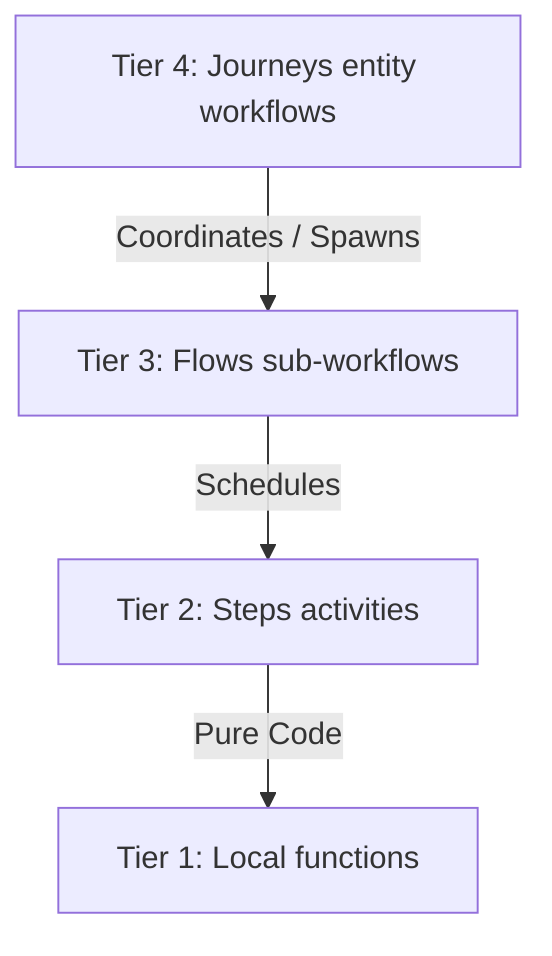
```mermaid
graph TB
    T4["Tier 4: Journeys entity workflows"]
    T3["Tier 3: Flows sub-workflows"]
    T2["Tier 2: Steps activities"]
    T1["Tier 1: Local functions"]
    T4 -->|Coordinates / Spawns| T3
    T3 -->|Schedules| T2
    T2 -->|Pure Code| T1
```

**OrderFulfillmentJourney:**

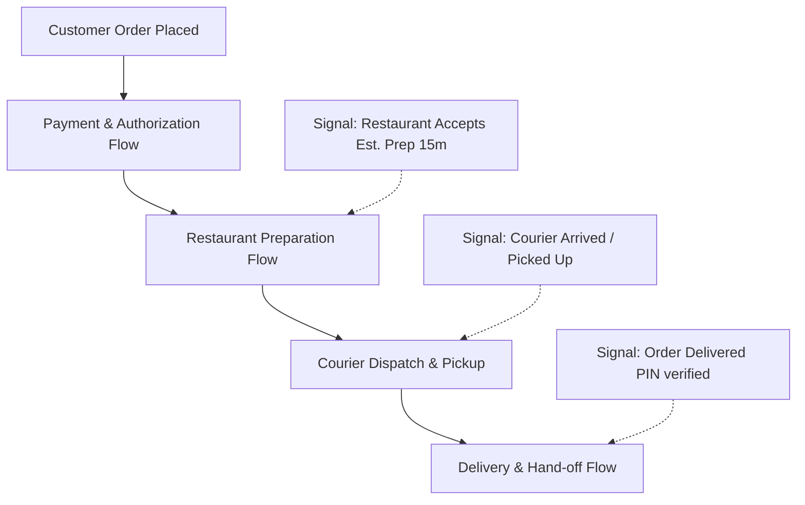
```mermaid
graph TB
    START["Customer Order Placed"] --> PAY["Payment & Authorization Flow"]
    PAY --> REST["Restaurant Preparation Flow"]
    REST --> COURIER["Courier Dispatch & Pickup"]
    COURIER --> DELIVERY["Delivery & Hand-off Flow"]
    SIG1["Signal: Restaurant Accepts Est. Prep 15m"] -.-> REST
    SIG2["Signal: Courier Arrived / Picked Up"] -.-> COURIER
    SIG3["Signal: Order Delivered PIN verified"] -.-> DELIVERY
```

**Flow A — Payment Authorization:** Runs as a child workflow to fail fast before notifying the restaurant. If payment fails, no food waste.

**Flow B — Restaurant Fulfillment:** Uses a Temporal Selector to wait concurrently for `AcceptOrder(prepTimeMinutes)`, `RejectOrder(reason)`, or a 5-minute timeout (auto-reject if tablet unresponsive).

**Flow C — Courier Dispatch & Matching:** Delayed launch using a workflow timer so the courier arrives just as food finishes cooking:

$$\text{Dispatch Delay} = \text{Target Pickup Time} - \text{Estimated Driver Transit Time}$$

**Tier 2 Activities:**

| Activity | Failure & Retry Policy |
|----------|----------------------|
| AuthorizePayment | Retry 3x on network failure; fail immediately on card decline |
| SendOrderToRestaurantPOS | Exponential backoff for 3 min; fallback to IVR phone call |
| AssignCourierLock | Short retry (15s SETNX timeout per candidate) |
| CapturePayment | Retry indefinitely (durable finance step) |
| SendPushNotification | Fire-and-forget; low-priority retry |

**Production Go Implementation:**

```go
func OrderFulfillmentJourney(ctx workflow.Context, orderID string) error {
    var saga CompensationSaga

    // Phase 1: Payment Authorization
    var paymentAuth PaymentAuthResult
    err := workflow.ExecuteChildWorkflow(ctx, PaymentAuthorizationFlow, orderID).Get(ctx, &paymentAuth)
    if err != nil {
        return err
    }
    saga.AddCompensation(VoidPaymentAuthorization, paymentAuth.AuthCode)

    // Phase 2: Restaurant Fulfillment
    var prepResult RestaurantPrepResult
    err = workflow.ExecuteChildWorkflow(ctx, RestaurantFulfillmentFlow, orderID).Get(ctx, &prepResult)
    if err != nil {
        saga.Compensate(ctx)
        return err
    }

    // Phase 3: Timed Courier Dispatch
    dispatchDelay := prepResult.EstimatedReadyTime.Sub(workflow.Now(ctx)) - EstimatedCourierTransitTime
    if dispatchDelay > 0 {
        workflow.Sleep(ctx, dispatchDelay)
    }

    var courierResult CourierMatchResult
    err = workflow.ExecuteChildWorkflow(ctx, CourierDispatchFlow, orderID, prepResult.RestaurantLocation).Get(ctx, &courierResult)
    if err != nil {
        workflow.ExecuteActivity(ctx, CancelRestaurantOrder, orderID)
        saga.Compensate(ctx)
        return err
    }

    // Phase 4: Delivery & Payment Capture
    var deliverySignal DeliveryConfirmationSignal
    workflow.GetSignalChannel(ctx, "delivery-channel").Receive(ctx, &deliverySignal)

    if deliverySignal.Status == "DELIVERED" {
        return workflow.ExecuteActivity(ctx, CapturePayment, orderID, paymentAuth.AuthCode).Get(ctx, nil)
    }
    saga.Compensate(ctx)
    return fmt.Errorf("delivery failed")
}
```

**Key architectural takeaways:**
- **Failure Isolation:** A restaurant rejection voids the credit card hold without dispatching a courier.
- **Durable Timers:** `workflow.Sleep` survives server restarts — timer state is preserved in event history.
- **Decoupled Scaling:** Payment, POS, and Courier workers scale independently on distinct fleets.

## Edge Infrastructure, Identity & Rate Limiting

At Uber's scale — handling millions of concurrent mobile clients, web applications, and third-party integrations across the globe — the edge infrastructure serves as the front door to thousands of internal microservices (DOMA architecture). To secure this perimeter, Uber uses a layered defense strategy operating across Edge Routing, Identity & Token Management, and Distributed Rate Limiting.

### Edge Architecture Topology

Uber's edge topology relies on a two-tier gateway design to separate threat mitigation from business routing.

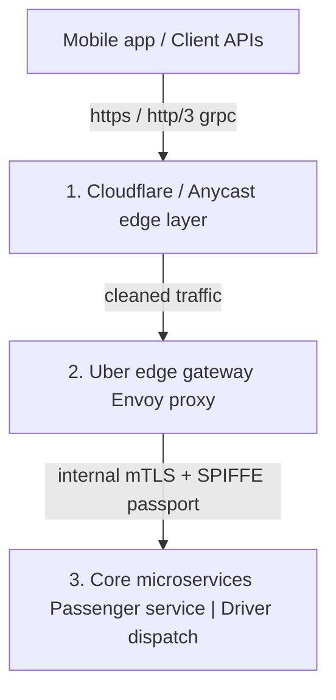
```mermaid
graph TB
    CLIENTS["Mobile app / Client APIs"] -->|https / http/3 grpc| CF["1. Cloudflare / Anycast edge layer"]
    CF -->|cleaned traffic| GW["2. Uber edge gateway Envoy proxy"]
    GW -->|internal mTLS + SPIFFE passport| MS["3. Core microservices Passenger service | Driver dispatch"]
```

**Tier 1: Anycast & Public Edge (Cloudflare WAF)**

- Anycast IP routing sends traffic to the nearest global PoP, minimizing TCP/TLS handshake latency.
- DDoS and L7 inspection blocks volumetric L3/L4 SYN floods and L7 HTTP floods before traffic enters Uber's private datacenters.
- TLS termination near the user establishes optimized long-lived TCP/gRPC connections back to Uber's origin.

**Tier 2: Core API Gateway (Envoy Proxy)**

Once inside Uber's network, the Envoy-based gateway performs four critical functions:
- **Protocol Translation:** Converts external REST/JSON or HTTP/2 gRPC into internal gRPC over Thrift or Protobuf.
- **Path & Tenant Routing:** Routes `/v1/trips` or `/v1/eats` to respective microservice clusters based on header metadata, geo-location, and canary deployment flags.
- **Edge Authentication (Token Swapping):** Converts public bearer tokens into authenticated internal identity objects.
- **Resiliency Circuits:** Enforces timeouts, retries with backoff, and circuit breakers (hedged requests) to prevent cascading failures.

### Security, OAuth2 & Identity Engineering

Managing session state for millions of riders and drivers requires a dual-token identity pipeline: external OAuth2 tokens for public transport and internal Passports for microservices.

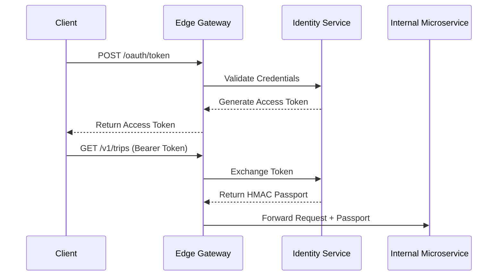
```mermaid
sequenceDiagram
    participant Client
    participant EG as Edge Gateway
    participant IS as Identity Service
    participant MS as Internal Microservice

    Client->>EG: POST /oauth/token
    EG->>IS: Validate Credentials
    IS-->>EG: Generate Access Token
    EG-->>Client: Return Access Token
    Client->>EG: GET /v1/trips (Bearer Token)
    EG->>IS: Exchange Token
    IS-->>EG: Return HMAC Passport
    EG->>MS: Forward Request + Passport
```

**External Authentication (OAuth2):** When a user logs in, the Identity Service issues a short-lived OAuth2 Access Token (1 hour) and a Refresh Token (stored in device Keychain/Keystore). Mobile clients send the access token in the `Authorization: Bearer <token>` header.

**The Identity Passport Pattern (Internal Token Swapping):** To prevent downstream microservices from repeatedly calling the Identity Service, the Edge Gateway exchanges the public OAuth2 token for a cryptographically signed Passport — a lightweight binary struct containing validated user metadata:

```json
{
  "user_id": "usr_9921_sf",
  "user_type": "DRIVER",
  "device_id": "dev_iphone_8832",
  "authenticated_at": 1770562800,
  "scopes": ["trips:read", "location:write"]
}
```

The Passport is HMAC-signed with a symmetric key shared across the internal mesh. Microservices verify the HMAC signature locally in sub-milliseconds without any network lookup.

**Zero-Trust Service-to-Service Security (SPIFFE/SPIRE & mTLS):** Every microservice workload is assigned a cryptographic identity (`spiffe://uber.com/ns/fulfillment/sa/driver-dispatch`). SPIRE agents issue and rotate short-lived X.509 SVID certificates to application pods. Sidecar proxies enforce zero-trust mTLS ACL policies — Service A can only talk to Service B if explicitly permitted.

### Distributed Rate Limiting (Radix Engine)

Rate limiting at Uber operates at multiple tiers to defend against brute-force credential stuffing, API abuse, and runaway internal clients. Uber built Radix, a custom high-throughput distributed rate-limiting system using Redis Clusters as an in-memory sliding window store.

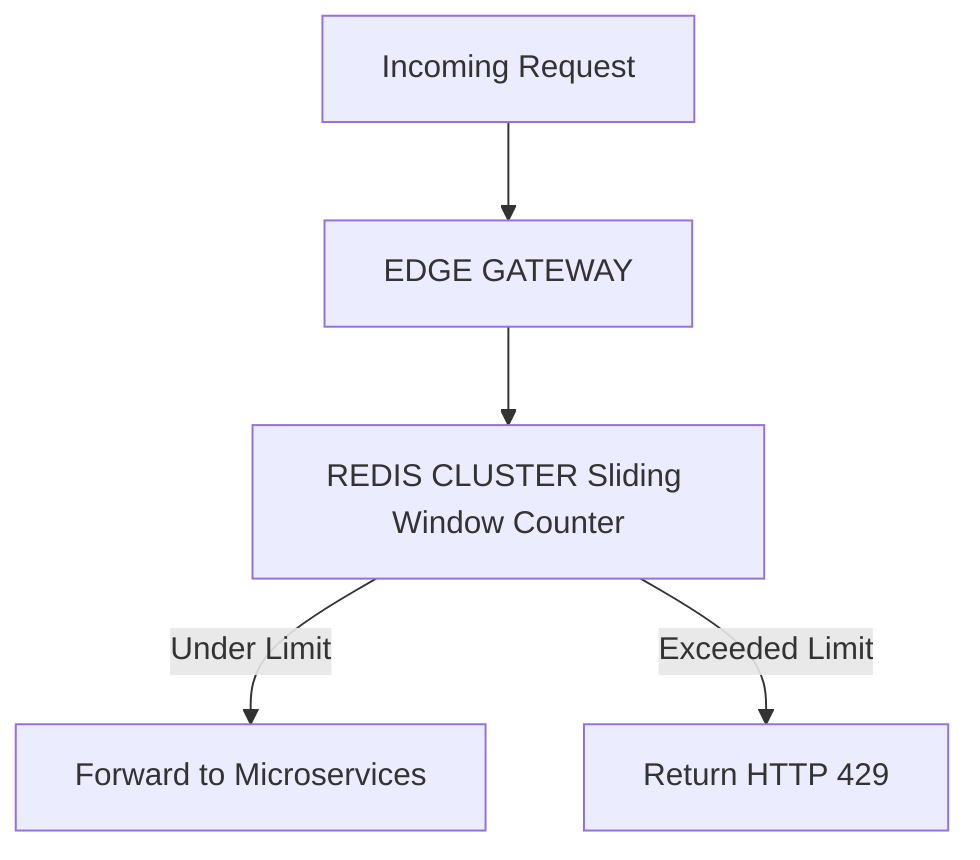
```mermaid
flowchart TD
    REQ["Incoming Request"] --> GW["EDGE GATEWAY"]
    GW --> REDIS["REDIS CLUSTER Sliding Window Counter"]
    REDIS -->|Under Limit| FORWARD["Forward to Microservices"]
    REDIS -->|Exceeded Limit| REJECT["Return HTTP 429"]
```

**Sliding Window Counter:** Instead of a fixed window (which suffers from boundary spikes), Radix uses a sliding window via atomic Lua script with INCRBY and EXPIRE over time buckets:

$$\text{Current Weight} = \text{Count}_{\text{current}} + \text{Count}_{\text{previous}} \times \left(1 - \frac{\text{Time elapsed in current window}}{\text{Window duration}}\right)$$

**Token Bucket (Burst Management):** Used for endpoints that naturally burst (e.g., driver location pings every 4s). Defines a capacity bucket and refill rate — allows bursts up to capacity, then smooths to the refill rate.

**Multi-Dimensional Rate Limit Keys:**

| Target Scope | Key Definition | Purpose |
|-------------|----------------|---------|
| IP-Based (Global) | `ip:{client_ip}:all` | Blocks botnets and global scraping |
| Authentication | `ip:{client_ip}:endpoint:/v1/login` | Brute-force prevention (max 5 attempts/min) |
| Per-User Endpoint | `user:{user_id}:endpoint:/v1/payment` | Prevents duplicate credit card charge attempts |
| Partner API | `client_id:{partner_app}:all` | Enforces tier-based B2B developer API limits |

### Architecture Summary

| Security Tier | Core Technology | Operational Benefit |
|---------------|-----------------|---------------------|
| Public Perimeter | Cloudflare Anycast + Envoy Edge Gateway | Anycast routing, L3/L4 DDoS scrubbing, TLS termination |
| Public Auth | OAuth2 (Short-lived Access + Refresh Tokens) | Standardized secure authentication for mobile & web |
| Internal Auth | Passport Pattern (Token-to-Passport Swap) | Eliminates auth-service bottlenecks; local HMAC verification |
| Service Identity | SPIFFE/SPIRE + Mutual TLS (mTLS) | Zero-trust service mesh preventing lateral movement |
| Rate Limiting | Radix Engine (Redis Sliding Window Counters) | Multi-dimensional protection against DDoS, brute-force, and API abuse |